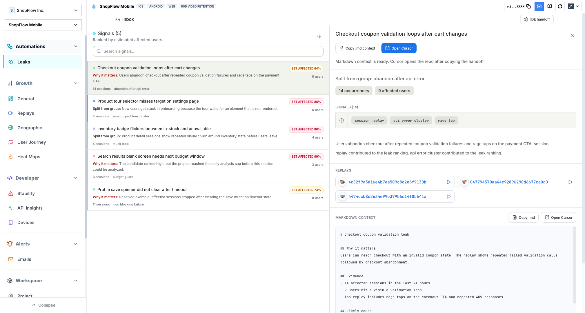
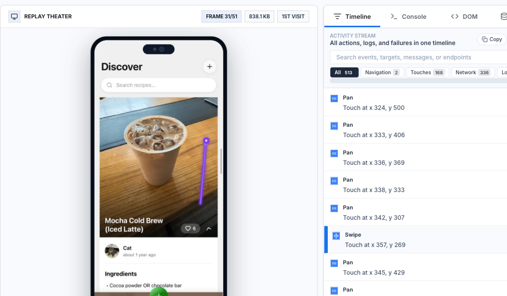
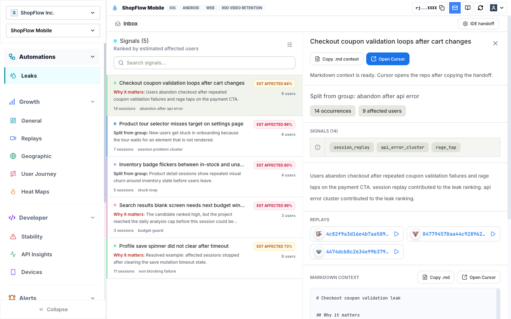
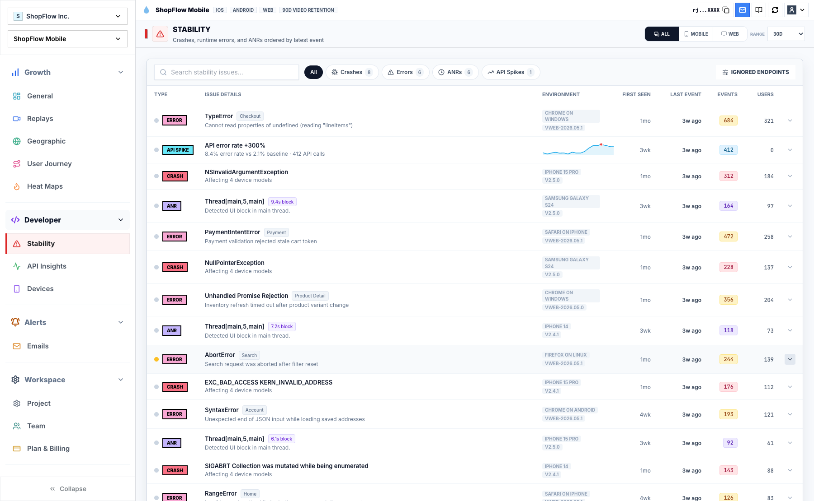
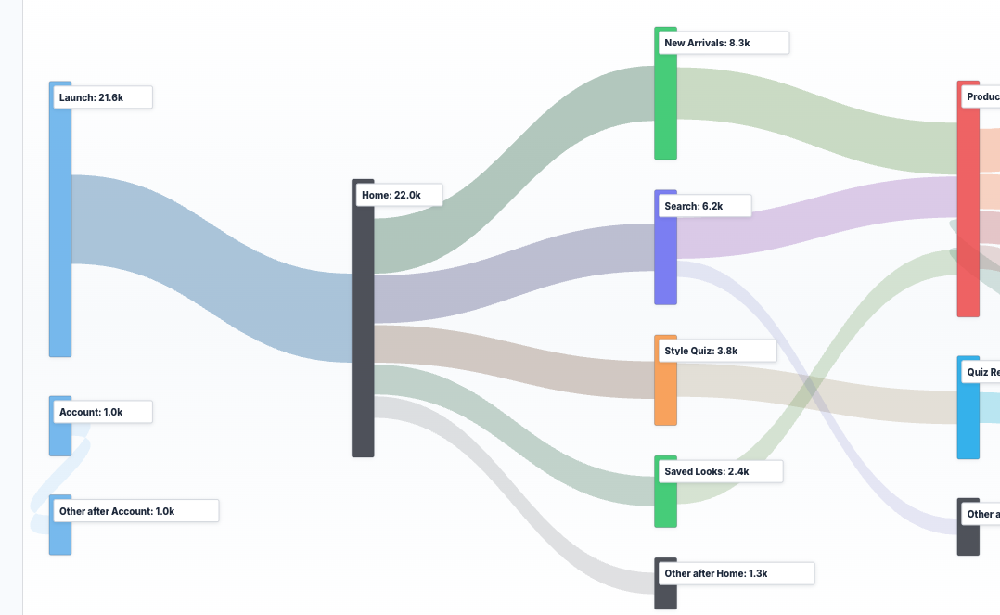
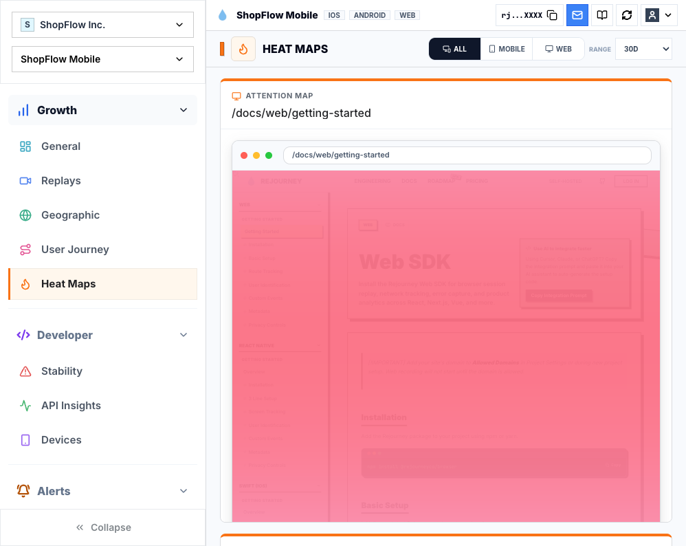
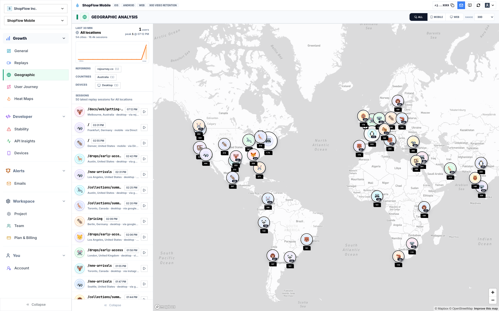
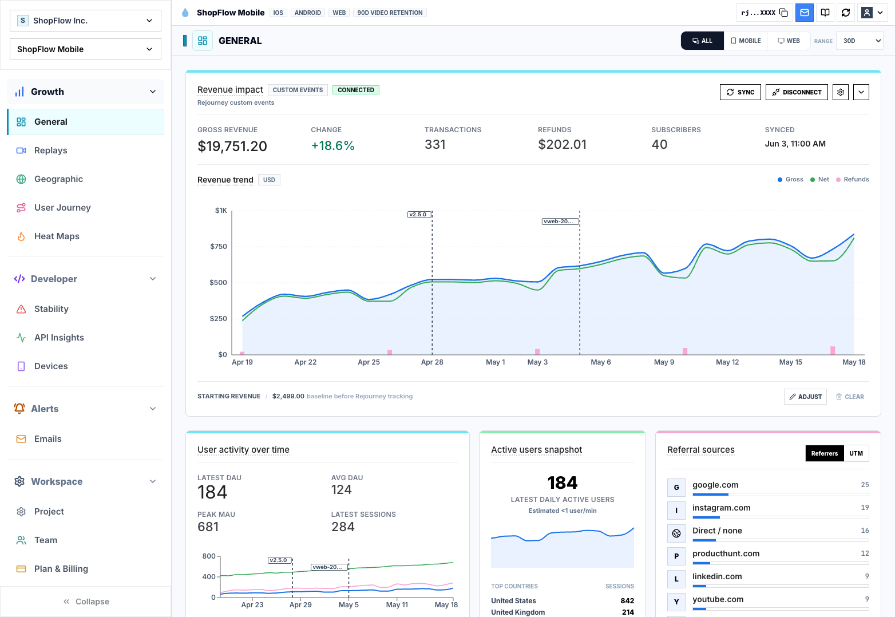

  <h1>
    
    Rejourney
  </h1>

  

  

    <strong>Lightweight session replay and observability for Mobile and Web Apps</strong>
     
    Focus with pixel-perfect video capture and real-time incident detection.
  

  
  

    <a href="https://rejourney.co"><strong>Explore the Website »</strong></a>
  

  
  

    
    
    
  

  

    
    
    
    
  

## Features

### Pixel Perfect Capture

True FPS video playback capturing every rendered pixel. Unlike competitors, we capture everything—including Mapbox (Metal), custom shaders, and GPU-accelerated views.

### Issue Detection

Rank repeated funnel leaks, rage taps, API failures, and replay evidence into fix-ready context packets.

### Error/ANR/Crash Detection

Automatic detection of Application Not Responding events with full thread dumps and main thread analysis.

### Journey Mapping

Visualize how users navigate your app. Identify high-friction drop-off points and optimize conversion funnels.

### Interaction Heat Maps

**Visualize user engagement with precision.** See where they tap, swipe, and scroll to optimize UI placement.

### Global Stability

Monitor performance and stability across different regions. Spot infrastructure issues before they affect your global audience.

### Growth Engines

Track user retention and loyalty segments. Understand how releases impact your power users versus bounce rates.

## Documentation

Full integration guides and API reference: https://rejourney.co/docs/reactnative/overview

### Self-Hosting

- Single-node Docker Compose self-hosting: https://rejourney.co/docs/selfhosted
- Enterprise-grade K3s hosting (architecture docs): https://rejourney.co/docs/architecture/distributed-vs-single-node

### Operations (K8s / Tailscale / admin hostnames)

- [Cloud architecture + Tailscale diagrams](dev_docs/allthingscloud.md) — deployment overview, public vs tailnet admin path.
- [ClickHouse API endpoint stats migration](dev_docs/clickhouse-api-endpoint-daily-stats-migration.md) — analytics scale-out plan and backfill/cutover runbook.
- [Network exposure and Tailscale](dev_docs/network-exposure-and-tailscale.md) — which `rejourney.co` hosts stay public; kube API on tailnet.
- [Admin tools without public URLs](dev_docs/admin-tools-private-access.md) — pgweb, Redis Commander, Netdata, Traefik, Uptime Kuma via `kubectl port-forward`.

## Contributing

Want to contribute to Rejourney? See our Contributing Guide: https://rejourney.co/docs/community/contributing

## Local Development

Local development mirrors production through [`local-k8s/`](local-k8s). For a fresh checkout, copy `local-k8s/env.example` to `.env.k8s.local`, fill the required local secrets, then run `npm run ci:local` to install, validate, build, deploy, migrate, and start the local stack. After that first bootstrap, use `npm run dev` for the hot-reload daily workflow.

`docker-compose.selfhosted.yml` is the official single-node self-hosted deployment path.

## Benchmarks

Rejourney is designed to stay out of the way: small package footprint, low browser intensity, and mobile capture work that keeps the main thread clear. The landing-page benchmark gallery is directly linkable at [rejourney.co/#benchmark-gallery](https://rejourney.co/#benchmark-gallery).

### Web vs PostHog

Live Chromium benchmark across the three web fixtures: Next.js, SvelteKit, and Nuxt. Each SDK ran against a live project endpoint for 3 iterations per framework. Lower is better for every metric below.

**Evidence:** [benchmark report](benchmarks/web-analytics/results/2026-05-19T03-47-21-774Z/benchmark-report.md), [raw results](benchmarks/web-analytics/results/2026-05-19T03-47-21-774Z/benchmark-results.json), [Rejourney live network captures](benchmarks/web-analytics/results/2026-05-19T03-47-21-774Z/rejourney-live-network-captures.json), [PostHog network captures](benchmarks/web-analytics/results/2026-05-19T03-47-21-774Z/posthog-network-captures.json).

| Section | Winner | Margin |
| :--- | :---: | :--- |
| Bundlephobia gzipped package size | Rejourney | **3.9x smaller** than `posthog-js` |
| Median live SDK upload body | Rejourney | **3.0x smaller** than PostHog |
| Browser task duration | Rejourney | **1.1x lower** median task time |
| Script execution time | Rejourney | **2.0x lower** median script time |
| Final JS heap | Rejourney | **1.4x lower** median heap |

#### Package Size

Bundlephobia fixed-version package size. Gzip is the transfer-size segment; minified is the full bar represented in the gallery.

| Package | Version | Minified | Gzipped | Source |
| :--- | :---: | ---: | ---: | :--- |
| `@rejourneyco/browser` | `0.1.0` | **52.3 kB** | **15.9 kB** | [Bundlephobia](https://bundlephobia.com/package/@rejourneyco/browser@0.1.0) |
| `posthog-js` | `1.374.2` | 187.5 kB | 61.5 kB | [Bundlephobia](https://bundlephobia.com/package/posthog-js@1.374.2) |

#### Live Web Benchmark Metrics

| App | Rejourney upload | PostHog upload | Rejourney task | PostHog task | Rejourney script | PostHog script | Rejourney heap | PostHog heap |
| :--- | ---: | ---: | ---: | ---: | ---: | ---: | ---: | ---: |
| Next.js | **21.29 KiB** | 45.35 KiB | **417.96 ms** | 449.91 ms | **160.46 ms** | 185.06 ms | **15.81 MiB** | 16.19 MiB |
| SvelteKit | **8.38 KiB** | 24.99 KiB | **268.72 ms** | 304.03 ms | **19.35 ms** | 42.02 ms | **6.63 MiB** | 9.17 MiB |
| Nuxt | **8.40 KiB** | 26.57 KiB | **305.51 ms** | 322.24 ms | **21.12 ms** | 41.17 ms | **11.33 MiB** | 15.44 MiB |

### Mobile vs Sentry

Rejourney Mobile uses an async capture pipeline with run loop gating, so capture work can happen off the app's critical rendering path and automatically pause during high-interaction periods.

#### React Native Package Size

| Package | Version | Minified | Gzipped | Winner |
| :--- | :---: | ---: | ---: | :--- |
| `@rejourneyco/react-native` | `1.0.17` | **39.7 kB** | **13.2 kB** | **10.2x smaller minified JS bundle** |
| `@sentry/react-native` | `8.7.0` | 403 kB | 135.3 kB | - |

Sources: [`@rejourneyco/react-native` on Bundlephobia](https://bundlephobia.com/package/@rejourneyco/react-native@1.0.17), [`@sentry/react-native` on Bundlephobia](https://bundlephobia.com/package/@sentry/react-native@8.7.0).

#### Mobile Performance

**Device:** iPhone 15 Pro (iOS 26)  
**Environment:** Expo SDK 54, React Native New Architecture  
**Test App:** [Merch App](https://merchcampus.com) production build with Mapbox Metal and Firebase  
**Test Workload:** 46 complex feed items, Mapbox GL View, 124 API calls, 31 subcomponents, active gesture tracking, and real-time privacy redaction.

| Metric | Avg (ms) | Max (ms) | Min (ms) | Thread |
| :--- | ---: | ---: | ---: | :---: |
| **Main: UIKit + Metal Capture** | **12.4** | 28.2 | 8.1 | Main |
| **BG: Async Image Processing** | 42.5 | 88.0 | 32.4 | Background |
| **BG: Tar+Gzip Compression** | 14.2 | 32.5 | 9.6 | Background |
| **BG: Upload Handshake** | 0.8 | 2.4 | 0.3 | Background |
| **Total Main Thread Impact** | **12.4** | 28.2 | 8.1 | Main |

Total Main Thread Impact is the only work in this table that blocks app rendering.

## Engineering

Engineering decisions and architecture: https://rejourney.co/engineering

## License

Client-side components (SDKs, CLIs) are licensed under Apache 2.0. Server-side components (backend, dashboard) are licensed under SSPL 1.0. See [LICENSE-APACHE](LICENSE-APACHE) and [LICENSE-SSPL](LICENSE-SSPL) for details.

---

## Translations

- [Arabic | العربية](i18n/README_AR.md)
- [Chinese (Simplified) | 简体中文](i18n/README_ZH_CN.md)
- [French | Français](i18n/README_FR.md)
- [German | Deutsch](i18n/README_DE.md)
- [Hindi | हिन्दी](i18n/README_HI.md)
- [Indonesian | Bahasa Indonesia](i18n/README_ID.md)
- [Japanese | 日本語](i18n/README_JA.md)
- [Korean | 한국어](i18n/README_KO.md)
- [Portuguese (Brazil) | Português do Brasil](i18n/README_PT_BR.md)
- [Spanish | Español](i18n/README_ES.md)
- [Turkish | Türkçe](i18n/README_TR.md)
