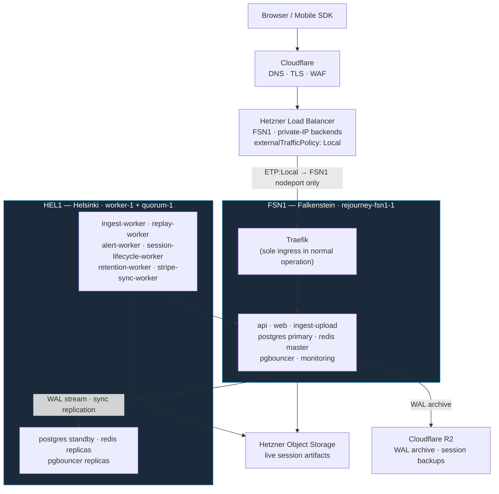
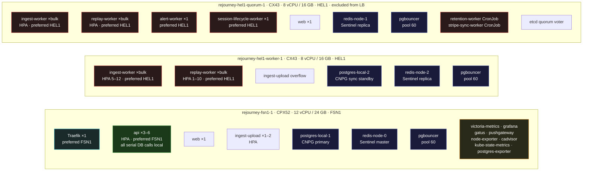
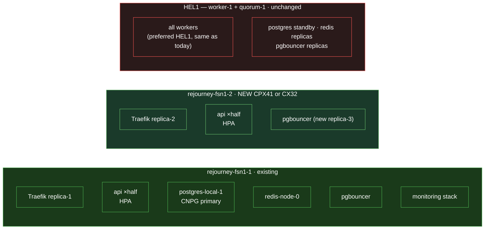

# All Things Cloud

Last updated: 2026-04-27

Operator-facing map of production: traffic path, pod placement, storage, HA failover, and the reasoning behind every architectural decision.

Related docs: [admin-tools-private-access.md](./admin-tools-private-access.md) · [rejourney-ci.md](./rejourney-ci.md) · [postgres-backup-and-restore.md](./postgres-backup-and-restore.md)

---

## Nodes

| Hetzner / k8s name | Type | DC | vCPU | RAM | Role |
|---|---|---|---|---|---|
| `rejourney-fsn1-1` | CPX52 | FSN1 (Falkenstein) | 12 | 24 GB | API · ingress · primary DB · monitoring |
| `rejourney-hel1-worker-1` | CX43 | HEL1 (Helsinki) | 8 | 16 GB | Bulk workers · standby DB |
| `rejourney-hel1-quorum-1` | CX43 | HEL1 (Helsinki) | 8 | 16 GB | Bulk workers · etcd quorum · excluded from LB |

Hetzner server names and k8s node names are the same (aligned 2026-04-27). **Never rename a Hetzner server without also changing `node-name` in `/etc/rancher/k3s/config.yaml` and rebuilding all PV nodeAffinity entries** — mismatches cause CCM `network-unavailable` taints and block pod scheduling cluster-wide.

**FSN1 ↔ HEL1 RTT: ~25ms.** Every serial cross-DC call adds 25ms. API handlers make 5–10 serial DB calls — a HEL1 API pod adds 125–250ms of pure wire overhead per request.

All nodes carry `rejourney.co/datacenter=fsn1|hel1`. New nodes must get this label on join.

---

## Setup



**Public path:** Internet → Cloudflare → Hetzner LB (FSN1) → Traefik → backends

**Admin path:** Tailscale tailnet → SSH / kubectl / port-forward over `100.x` addresses. Admin UIs (Grafana, Traefik dashboard) are not public.

---

## Pod topology (current)



**Color key:**
- **Green** — API pods: pinned to FSN1 (preferred affinity, weight 100). Cross-DC adds 25ms per DB call; all 5–10 serial calls per request stay local.
- **Blue** — Data: CNPG primary + Redis master on FSN1, standbys/replicas on HEL1. pgbouncer on all three nodes.
- **Red** — Workers: prefer HEL1 (preferred affinity, weight 100), fall back to FSN1 only when HEL1 is full. DB latency is acceptable for async processing; ingest/replay writes use `SET LOCAL synchronous_commit = local` to skip the 25ms SyncRep wait.
- **Cyan** — Ingress: Traefik single replica on FSN1. quorum-1 excluded from LB entirely.
- **Orange** — Monitoring: all on FSN1 for simplicity. Goes dark if FSN1 fails — acceptable gap.

---

## Future topology (next FSN1 node)



See [Compute Scaling Plan](#compute-scaling-plan) for the exact steps.

---

## Component decisions

### Hetzner Load Balancer

- FSN1 location, round-robin across `fsn1` and `worker-1` backends. quorum-1 excluded via `node.kubernetes.io/exclude-from-external-load-balancers: "true"`.
- Uses private IPs — traffic stays inside the Hetzner private network.
- `externalTrafficPolicy: Local` on the Traefik service. Without this, kube-proxy could VXLAN-forward to the other DC's Traefik pod before the request hits Traefik, adding an invisible 25ms hop.

### Traefik

- **1 replica, preferred FSN1.** With ETP:Local, the LB health check on `worker-1`'s nodeport returns unhealthy when no Traefik pod is there — LB routes 100% to FSN1 automatically. On FSN1 failure, Traefik reschedules to `worker-1` (~90s) and the LB detects it healthy.
- Required to exclude nodes with `node.kubernetes.io/exclude-from-external-load-balancers` (quorum-1).
- Trusts Cloudflare IP ranges for real-IP passthrough on both entry points.
- Middlewares: `https-redirect`, `http-www-redirect`, `www-redirect`, `security-headers`, `rate-limit-api` (1 000 req/min, burst 5 000), `rate-limit-ingest` (20 000 req/min, burst 40 000).
- Metrics on a separate `metrics` entry point, scraped by VictoriaMetrics.

### API

- **Preferred FSN1, weight 100** (`rejourney.co/datacenter=fsn1`). Preferred (not required) so pods fall back to HEL1 if FSN1 is down.
- **No `topologySpreadConstraints`** — tested: `maxSkew:1 ScheduleAnyway` overrides a weight-80 preference and spreads pods to HEL1, causing 6–11s p50.
- **HPA: min 3, max 6, target 65% CPU.** Min 3 fits entirely on FSN1 in normal operation.
- **Post-deploy pin check** in CI (`pin_deployment_to_fsn1` in `scripts/k8s/deploy-release.sh`): after every rollout, evicts any API pods that landed on HEL1 and waits for FSN1 rescheduling. Prevents silent latency regressions after rolling updates during FSN1 surge.

### `ingest-worker`, `replay-worker`

- **Preferred HEL1, weight 100.** Fall back to FSN1 only when HEL1 is full.
- HPA: `ingest-worker` 5–12, `replay-worker` 1–10.
- IO-bound, not CPU-bound — HPA undershoots during queue spikes (workers sit at 30–40% CPU while waiting on DB round-trips). If the queue grows: manually scale and patch the HPA max first.
- All `ingest_jobs` writes use `SET LOCAL synchronous_commit = local` — skips the 25ms SyncRep round-trip per write. Each job does 2–3 status writes; at 12 workers × 75 concurrent jobs this was the throughput ceiling before the fix.

### `ingest-upload`

- HPA: min 1, max 2. S3-only writes, no DB affinity needed.

### `alert-worker`, `session-lifecycle-worker`

- Single-replica, preferred HEL1.

### `retention-worker`, `stripe-sync-worker`

- CronJobs, preferred HEL1. Periodic, not latency-sensitive.

### `web`

- 2 replicas, no affinity. Static/SSR, no DB calls.

### pgbouncer

- **3 replicas, one per node, pool 60 connections each.** Total: 180 server connections, under `max_connections: 200`.
- All connect to `postgres-app-rw` (CNPG label selector `cnpg.io/instanceRole: primary`) — always resolves to current primary after failover.
- `trafficDistribution: PreferClose` — kube-proxy routes to local-node pgbouncer, falls back automatically.
- **`required` anti-affinity on hostname** — exactly one per node, always. Do not change to `preferred` and do not add `maxSurge: 1`. With 3 nodes, a surge pod has nowhere to go and deadlocks the rollout.
- Rolling update: `maxSurge: 0, maxUnavailable: 1`.
- **When adding a node, bump replicas to match new node count before deploying.** Also raise `max_connections` if total pool × 60 approaches 200.

### CNPG (postgres-local)

- 2 instances: `postgres-local-1` (primary, FSN1) + `postgres-local-2` (sync standby, worker-1).
- `synchronous_commit = remote_write`, `minSyncReplicas: 1`, `maxSyncReplicas: 1`. Adds ~25ms to write commits. `maxSyncReplicas: 1` means postgres degrades to async rather than blocking if standby is down.
- **SyncRep is the write throughput ceiling.** 33 concurrent SyncRep waits = 33 blocked connections. Ingest workers mitigate with `SET LOCAL synchronous_commit = local`. For any new write-heavy path: check `pg_stat_activity WHERE wait_event = 'SyncRep'` first.
- WAL archived to Cloudflare R2 (gzip). See `postgres-backup-and-restore.md`.
- Storage: `rejourney-db-local-retain` (local-path, Retain). Data is on the node's local disk — not Hetzner cloud volumes. PVCs survive pod/cluster deletion. Standby + R2 WAL archive are the recovery paths.

### Redis

- 3-node StatefulSet: `redis-node-0` (FSN1, master), `redis-node-1` (quorum-1, replica), `redis-node-2` (worker-1, replica).
- Sentinel quorum = 2/3. On FSN1 failure, HEL1 Sentinels elect a new master.
- 8 GiB volumes per node, `reclaimPolicy: Retain`.

### Monitoring (all on FSN1)

| Component | Purpose |
|---|---|
| VictoriaMetrics | Metrics store. Scraped from node-exporter, cadvisor, kube-state-metrics, postgres-exporter, redis-metrics, Traefik, pushgateway. |
| Grafana | Dashboard UI. Port-forwarded for operator access. |
| Gatus | Public endpoint + internal service health checks. |
| Pushgateway | Push metrics from CronJobs and short-lived pods. |
| node-exporter | DaemonSet — one per node. |
| cadvisor | DaemonSet — one per node. |
| kube-state-metrics | Cluster-level k8s object metrics. |
| postgres-exporter | Scrapes CNPG primary. |

### CoreDNS

- 2 replicas (1 FSN1, 1 HEL1). Without a HEL1 replica, FSN1 failure causes 30–60s cluster-wide DNS outage.
- **Not CI-managed** — k3s controls CoreDNS via its internal addon mechanism. Verify after any k3s upgrade with `kubectl get pods -n kube-system -l k8s-app=kube-dns`.

### Storage classes

| Class | Driver | Reclaim | Used by |
|---|---|---|---|
| `rejourney-db-local-retain` | local-path | Retain | postgres, redis |
| `local-path` | local-path | Delete | grafana, victoria-metrics, gatus, pgadmin |

**Retain policy on DB volumes is critical.** Deleting a PVC does NOT delete the underlying data. Recreating CNPG or Redis without verifying volumes creates orphaned data silently.

---

## HA failover

| Failure | What happens |
|---|---|
| FSN1 API pods | Reschedule to HEL1. Slower until postgres/Redis failover completes (~30s). |
| CNPG primary | `postgres-local-2` auto-promotes. `postgres-app-rw` selector follows new primary. pgbouncer on HEL1 reconnects to local primary. |
| In-flight writes at crash | No data loss — `remote_write` means every committed write was already buffered on standby. Exception: ingest job status writes (`SET LOCAL synchronous_commit = local`) may revert to pending and be reprocessed (idempotent). |
| Redis master | Sentinel elects new master within seconds. |
| Traefik | Reschedules to `worker-1` (~90s). LB detects `worker-1` nodeport healthy and resumes routing. |
| CoreDNS | Second replica on HEL1 keeps DNS alive. |
| Monitoring | victoria-metrics, Grafana, Gatus go offline. Accepted gap. |

**Post-failover:** once CNPG promotes (~30s) and Redis elects master (~5s), HEL1 API pods hit local pgbouncer → local postgres → local Redis. Latency recovers close to FSN1 levels.

---

## Ingress routing

| Host | Path | Backend | Middlewares |
|---|---|---|---|
| `rejourney.co` | `/` | `web:80` | security-headers |
| `www.rejourney.co` | `/` HTTP | — | http-www-redirect |
| `www.rejourney.co` | `/` HTTPS | `web:80` | www-redirect |
| `api.rejourney.co` | `/api/ingest`, `/api/sdk/config` | `api:3000` | security-headers, rate-limit-ingest |
| `api.rejourney.co` | `/` | `api:3000` | security-headers, rate-limit-api |
| `ingest.rejourney.co` | `/upload` | `ingest-upload:3001` | security-headers, rate-limit-ingest |
| `ingest.rejourney.co` | `/` | `api:3000` | security-headers, rate-limit-ingest |
| `*.rejourney.co` HTTP | `/` | — | https-redirect |

---

## Operational gotchas

1. **Never rename a Hetzner server without a coordinated k3s migration.** CCM matches Hetzner server names to k8s node names. Mismatch → `network-unavailable:NoSchedule` taint → no pods schedule there. Also breaks PV nodeAffinity (immutable field — must delete/recreate PVs). Requires: k3s `node-name` config change on all nodes, cluster-reset if etcd gets corrupted, flannel FDB repopulation (k3s restart on all nodes), PV rebuild.

2. **API and Traefik affinity use `rejourney.co/datacenter=fsn1`.** New nodes must be labelled on join. Workers use `rejourney.co/datacenter=hel1`.

3. **Do not add `topologySpreadConstraints` to the API deployment.** `maxSkew:1 ScheduleAnyway` overrides the preferred affinity and spreads pods to HEL1, causing 6–11s p50 response times.

4. **Do not change `externalTrafficPolicy` back to `Cluster`.** Adds an invisible 25ms kube-proxy VXLAN hop before every Traefik request.

5. **quorum-1 is excluded from the Hetzner LB** via `node.kubernetes.io/exclude-from-external-load-balancers: "true"`. Do not remove this label.

6. **pgbouncer anti-affinity is `required`.** One per node, always. Do not change to `preferred`, do not add `maxSurge: 1` — with 3 nodes and 3 pods, a surge pod deadlocks the rollout. When adding a node, bump replicas first.

7. **CNPG sync replication degrades to async when standby is down.** `maxSyncReplicas: 1` — intentional. You briefly lose the sync guarantee during CNPG upgrades.

8. **HPA undershoots for IO-bound workers.** `ingest-worker` and `replay-worker` stay at 30–40% CPU while waiting on DB. If the queue grows, HPA won't fire. Manually scale: `kubectl scale deployment ingest-worker --replicas=12`, patch HPA max first.

9. **After rolling updates, check API pod placement.** `preferred` affinity lets pods land on HEL1 during FSN1 surge. CI auto-corrects via `pin_deployment_to_fsn1`. If you see slow API after a deploy: `kubectl get pods -n rejourney -l app=api -o wide`.

10. **SyncRep is the write throughput ceiling.** Every committed write waits ~25ms for standby ACK. For any new write-heavy path that becomes slow: check `pg_stat_activity WHERE wait_event = 'SyncRep'` first, then add `SET LOCAL synchronous_commit = local` if the path is acceptable to skip.

11. **DB storage is local-path, not Hetzner cloud volumes.** PVCs survive pod deletion (Retain) but permanent node destruction loses local data. Standby + R2 WAL archive are the recovery paths.

12. **CoreDNS replica count may reset on k3s upgrades.** Verify after any upgrade and re-apply `k8s/coredns-config.yaml`.

13. **Cloudflare WAF silently blocks ingest PUT requests.** No logs, no 4xx to the client — Cloudflare drops the request without notifying you. If ingest stops working and the API/ingest-upload pods look healthy: add a custom WAF pass-rule for PUT on `ingest.rejourney.co` first, before touching anything else. There are zero logs until that rule is in place.

---

## Compute Scaling Plan

Current state: 1 FSN1 node running API, DB primary, and monitoring. Next step is a **second FSN1 node** — more API headroom with local DB latency, not more HEL1 standby capacity.

### Step 0 — affinity labels ✅ done

All nodes carry `rejourney.co/datacenter`. New FSN1 nodes are immediately eligible for API/Traefik with just:
```bash
kubectl label node <new-node> rejourney.co/datacenter=fsn1
```

### Step 1 — add second FSN1 node

Recommended type: **CPX41** (16 vCPU, 32 GB, ~€33/mo) or **CX32** (8 vCPU, 32 GB, ~€19/mo). Add in FSN1 only. After the node joins:
```bash
kubectl label node <new-node> rejourney.co/datacenter=fsn1
# Remove LB exclusion label if present:
kubectl label node <new-node> node.kubernetes.io/exclude-from-external-load-balancers-
```

### Step 2 — scale pgbouncer to 4

pgbouncer requires one replica per node. With 4 nodes, set replicas = 4 and raise `max_connections` to at least 280 (4 × 60 = 240 connections, need headroom). Update `k8s/pgbouncer.yaml`.

### Step 3 — raise API HPA max

```yaml
# k8s/hpa.yaml
minReplicas: 3   # unchanged
maxReplicas: 8   # was 6
```

### Step 4 — run 2 Traefik replicas across both FSN1 nodes

```yaml
# k8s/traefik-config.yaml
replicas: 2
# affinity: required rejourney.co/datacenter=fsn1, required anti-affinity on hostname
```
Add the new FSN1 node as a Hetzner LB backend.

### What does not change

- CNPG: stays 1 primary + 1 standby. More replicas add sync overhead.
- Redis: stays 3-node Sentinel.
- HEL1 nodes: unchanged — HA standby and bulk worker capacity.
