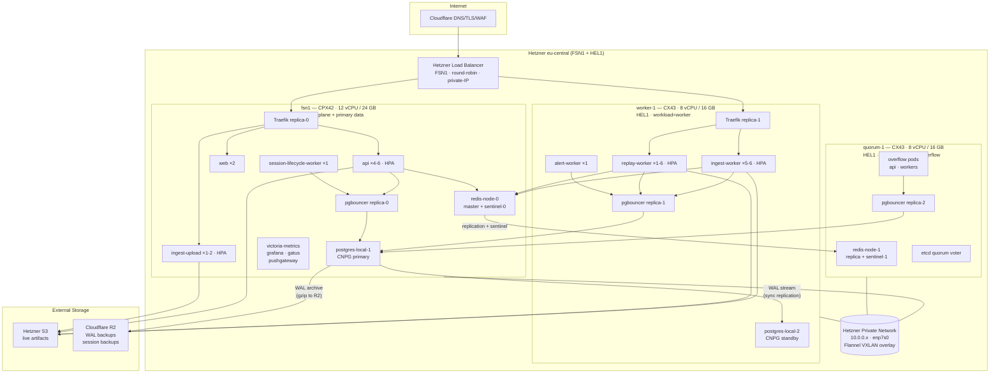

# All Things Cloud

Last updated: 2026-04-26

This is the operator-facing map of production: network path, deploy flow, storage layout, monitoring, backups, HA failover, and the runtime services we actually have today.

## Tailscale, public traffic, and admin access

**Public path:** Internet → **Cloudflare** (DNS / TLS / WAF) → **Hetzner Load Balancer** (FSN1, round-robin, private-IP backend) → **Traefik** (2 replicas: fsn1 + worker-1) → `rejourney.co`, `api.rejourney.co`, `ingest.rejourney.co`

**Admin path:** Operators join the **Tailscale tailnet** and use **SSH**, **kubectl**, and **kubectl port-forward** over `100.x` addresses. Admin UIs (Grafana, Traefik dashboard, Drizzle Studio) are not public.

**Important boundary:** Tailscale protects operator access to the node and cluster. It is not in the normal in-cluster service path. Internal traffic such as `Grafana → VictoriaMetrics` or `postgres-exporter → postgres-app-rw` stays on Kubernetes service networking.

Related docs:

- [admin-tools-private-access.md](./admin-tools-private-access.md)
- [rejourney-ci.md](./rejourney-ci.md)
- [legacy.md](./legacy.md)
- [postgres-backup-and-restore.md](./postgres-backup-and-restore.md)
- sibling repo `rejourney-internal/dev_docs/`

## Architecture

