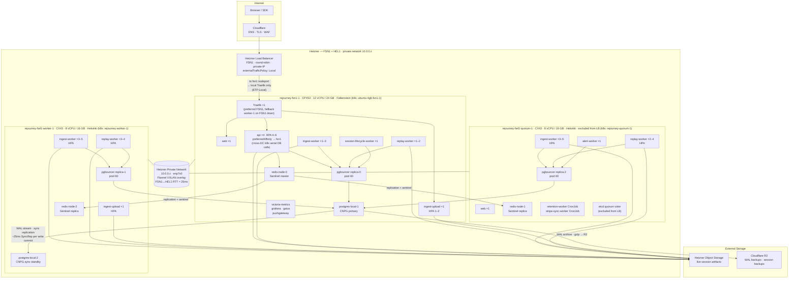
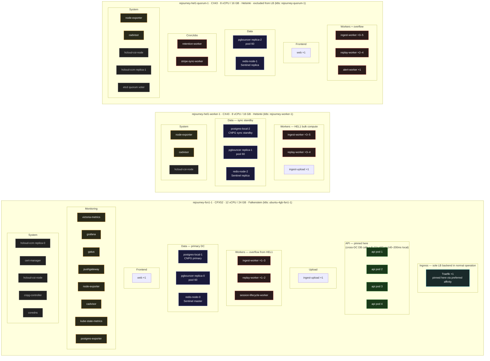

# All Things Cloud

Last updated: 2026-04-26 (HA fixes, SyncRep bottleneck fix, Traefik 1-replica FSN1 pin, pgbouncer pool 60, CI post-deploy pin check)

This is the operator-facing map of production: network path, deploy flow, storage layout, monitoring, backups, HA failover, and every architectural decision behind where things run and why.

## Tailscale, public traffic, and admin access

**Public path:** Internet → **Cloudflare** (DNS / TLS / WAF) → **Hetzner Load Balancer** (FSN1, round-robin, private-IP backend) → **Traefik** (1 replica pinned to FSN1) → `rejourney.co`, `api.rejourney.co`, `ingest.rejourney.co`

**Admin path:** Operators join the **Tailscale tailnet** and use **SSH**, **kubectl**, and **kubectl port-forward** over `100.x` addresses. Admin UIs (Grafana, Traefik dashboard, Drizzle Studio) are not public.

**Important boundary:** Tailscale protects operator access to the node and cluster. It is not in the normal in-cluster service path. Internal traffic such as `Grafana → VictoriaMetrics` or `postgres-exporter → postgres-app-rw` stays on Kubernetes service networking.


Related docs:

- [admin-tools-private-access.md](./admin-tools-private-access.md)
- [rejourney-ci.md](./rejourney-ci.md)
- [legacy.md](./legacy.md)
- [postgres-backup-and-restore.md](./postgres-backup-and-restore.md)
- sibling repo `rejourney-internal/dev_docs/`

---

## Nodes

| Hetzner name | k8s node name | Hetzner type | DC | vCPU | RAM | Role | CPU |
|---|---|---|---|---|---|---|---|
| `rejourney-fsn1-1` | `ubuntu-4gb-fsn1-1` | CPX52 | FSN1 (Falkenstein) | 12 | 24 GB | Primary data + API | ~41% |
| `rejourney-hel1-worker-1` | `rejourney-worker-1` | CX43 | HEL1 (Helsinki) | 8 | 16 GB | Workers + standby DB | ~44% |
| `rejourney-hel1-quorum-1` | `rejourney-quorum-1` | CX43 | HEL1 (Helsinki) | 8 | 16 GB | Workers + etcd quorum | ~45% |

**Hetzner display names ≠ k8s node names.** The Hetzner console names were updated on 2026-04-26 but the OS hostnames (set at server creation) are unchanged — k3s uses the OS hostname as the Kubernetes node name. Always use the k8s node name in `kubectl` commands, affinity rules, and manifests.

**RTT between FSN1 and HEL1: ~25ms.** This is the single most important number in the architecture. Every serial cross-DC call adds 25ms. Presign endpoints make 5–10 serial DB calls — on a HEL1 API pod that means 125–250ms of pure wire overhead per request, compounding to 6–11s observed p50 before the fix.

**Node label gotcha:** the Kubernetes hostname label on the FSN1 node is `ubuntu-4gb-fsn1-1`, not `fsn1`. Pod affinity rules must use the actual label — using the Hetzner server name silently does nothing. **Before adding new nodes, apply `rejourney.co/datacenter` labels and migrate affinity to use that label instead of hostname** (see Compute Scaling Plan).

---

## Architecture



---

## Pod topology

Where every pod actually runs and why.



**Placement rationale by color:**
- **Green (API pods)** — prefer FSN1 via node affinity (`preferred`, weight 100, label `rejourney.co/datacenter=fsn1`). Every API handler makes 5–10 serial DB + Redis calls; cross-DC adds 25ms per call, producing 6–11s observed p50 on HEL1 vs 140–200ms on FSN1.
- **Blue (data)** — CNPG primary and Redis master on FSN1, standbys on HEL1. pgbouncer on all three nodes so failover requires no reconfiguration.
- **Red (workers)** — bulk-compute workers spread across HEL1 to free FSN1 CPU for the API. Cross-DC DB latency is acceptable for async processing (ingest jobs use `SET LOCAL synchronous_commit = local` to skip the 25ms SyncRep wait per write).
- **Cyan (ingress)** — Traefik single replica on FSN1. quorum-1 excluded from LB entirely.
- **Orange (monitoring)** — all on FSN1 for simplicity. Goes offline if FSN1 fails — acceptable gap.

---

## Component decisions

### Hetzner Load Balancer

- Located in FSN1, round-robin across `fsn1` and `worker-1` backends only (`quorum-1` has `node.kubernetes.io/exclude-from-external-load-balancers: "true"`).
- Uses private IPs (`load-balancer.hetzner.cloud/use-private-ip: "true"`) so traffic stays inside the Hetzner private network.
- **`externalTrafficPolicy: Local` on the Traefik service** (set 2026-04-26). With `Cluster` (the default), kube-proxy on any node could VXLAN-forward to the other DC's Traefik pod before the request even hit Traefik — adding an invisible 25ms hop. `Local` forces kube-proxy to only route to a local Traefik pod.

### Traefik

- **1 replica pinned to FSN1** (changed from 2 on 2026-04-26). With `externalTrafficPolicy: Local`, the Hetzner LB health check on `worker-1`'s nodeport returns unhealthy when no Traefik pod is there — LB automatically routes 100% to FSN1. On FSN1 failure, Traefik reschedules to `worker-1` via `preferred` affinity (~90s recovery) and the LB detects `worker-1` as healthy again. Going to 1 replica eliminates the 50% of requests that previously went: LB → HEL1 Traefik → cross-DC → FSN1 API (12.5ms average tax across all requests).
- Affinity: `preferredDuringSchedulingIgnoredDuringExecution` for `rejourney.co/datacenter=fsn1`, `required` to exclude nodes with `node.kubernetes.io/exclude-from-external-load-balancers` (i.e. quorum-1). Any FSN1 node qualifies — adding a second FSN1 node automatically becomes eligible.
- Trusts Cloudflare IP ranges for `X-Forwarded-For` real IP passthrough on both `web` and `websecure` entry points.
- Middlewares in `rejourney` namespace: `https-redirect`, `http-www-redirect`, `www-redirect`, `security-headers`, `rate-limit-api` (1 000 req/min burst 5 000), `rate-limit-ingest` (20 000 req/min burst 40 000).
- Metrics exposed on a separate `metrics` entry point (not externally routed) and scraped by VictoriaMetrics.

### API (`api.rejourney.co`)

- **Node affinity: `preferredDuringSchedulingIgnoredDuringExecution`, weight 100, label `rejourney.co/datacenter=fsn1`.** Preferred (not required) so pods can overflow to HEL1 if FSN1 is down — HA preserved. Any node labelled `rejourney.co/datacenter=fsn1` qualifies, so adding a second FSN1 node automatically expands the eligible pool.
- **`topologySpreadConstraints` removed (2026-04-26).** Was scoring against the affinity and spreading pods to HEL1 in normal operation.
- **Post-deploy pin check in CI** (`scripts/k8s/deploy-release.sh` function `pin_deployment_to_fsn1`): after every rollout completes, CI checks if any API pod landed on a non-FSN1 node. If so, it evicts it (no rolling-update surge pressure at this point) and waits for it to reschedule to FSN1. Prevents HEL1 pods persisting silently after a rolling update during which FSN1 was briefly at capacity.
- HPA: min 4, max 6, target 65% CPU.
- `DB_POOL_MAX=50` per pod against pgbouncer; pgbouncer caps the actual postgres connections.

### `ingest-upload`

- Receives raw session upload chunks and streams them to Hetzner S3.
- HPA: min 1, max 2, target 70% CPU.
- 2 replicas spread across `fsn1` and `worker-1`. S3-only writes, no DB affinity needed.

### `ingest-worker`, `replay-worker`

- CPU/IO-heavy background workers spread across all three nodes.
- **`ingest-worker`: HPA 5–12 pods.** Raised from max 6 on 2026-04-26 — these workers are IO-bound (DB writes via pgbouncer), not CPU-bound. CPU-based HPA undershoots: workers sit at 30–40% CPU even when queue is growing because they spend most time waiting on DB round-trips. Max raised so manual scale-up is possible without fighting the HPA ceiling.
- **`replay-worker`: HPA 1–10 pods.**
- Both use `SET LOCAL synchronous_commit = local` for all `ingest_jobs` status writes (`markArtifactJobProcessing`, `markArtifactJobDone`, `scheduleArtifactJobRetry`, `recoverStuckArtifactJobs`). This skips the ~25ms SyncRep round-trip per write — critical for throughput since each job does 2–3 writes. The underlying data (artifacts in S3, session state in other tables) is unaffected; only the job queue tracking rows opt out of sync replication. If the primary crashes mid-job, the job reverts to `pending` and gets reprocessed (idempotent).

### `alert-worker`, `session-lifecycle-worker`

- Single-replica workers. `alert-worker` on `quorum-1`, `session-lifecycle-worker` on FSN1.

### `retention-worker`, `stripe-sync-worker`

- CronJobs running on `quorum-1`. Periodic, not latency-sensitive.

### `web` (`rejourney.co`)

- 2 replicas: one on `fsn1`, one on `quorum-1`. Static/SSR frontend — no DB affinity needed.

### pgbouncer

- **3 replicas, one per node, pool size 60 server connections each** (raised from 30 on 2026-04-26). Total: 3 × 60 = 180 server connections to Postgres, comfortably under `max_connections: 200`. Previous 30-per-pod caused 124ms average client wait time (measured via `SHOW STATS`) under normal load — raising to 60 eliminated the wait.
- All connect to `postgres-app-rw` which uses a live CNPG label selector (`cnpg.io/instanceRole: primary`) — always resolves to the current primary regardless of which CNPG instance is promoted.
- `trafficDistribution: PreferClose` — kube-proxy routes to the local node's pgbouncer when available, automatically falls back to any pgbouncer replica when local is absent. Requires k8s 1.31+ (GA); cluster is on 1.33.
- Pod anti-affinity: `required` on hostname — exactly one pgbouncer per node in all states. **Do not change to `preferred` and do not add `maxSurge: 1`.** With 3 nodes and 3 replicas, a surge pod has nowhere to go: running pods' `required` anti-affinity blocks the surge pod from co-locating, keeping it Pending forever and deadlocking the rollout (learned from CI failure 2026-04-26).
- Rolling update: `maxSurge: 0, maxUnavailable: 1`. `PreferClose` handles the brief gap.
- **When adding a new node, bump pgbouncer replicas by 1** — the `required` anti-affinity invariant means replicas must equal node count. See Compute Scaling Plan.

### CNPG (postgres-local)

- 2-instance cluster: `postgres-local-1` (primary, FSN1) + `postgres-local-2` (sync standby, worker-1).
- **Sync replication: `minSyncReplicas: 1`, `maxSyncReplicas: 1`, `synchronous_commit = remote_write`** (enabled 2026-04-26). Primary waits for the standby to confirm WAL is written to its OS buffer before acking a commit. Adds ~25ms to write transactions. `maxSyncReplicas: 1` ensures postgres does NOT block writes if the standby is temporarily down — degrades to async rather than stalling indefinitely.
- **SyncRep adds 25ms to every write commit and is the throughput ceiling for write-heavy paths.** Measured: 33 concurrent Postgres connections in `SyncRep` wait state during an ingest queue spike, blocking 34K+ job queue growth. Mitigated in ingest workers by `SET LOCAL synchronous_commit = local` per transaction (see ingest-worker above). For the API, critical writes (auth, payments) keep `remote_write`; non-critical writes should also use `SET LOCAL` if they become a bottleneck.
- WAL archived to Cloudflare R2 (gzip). Restores use `postgres-backup-and-restore.md`.
- Storage: `rejourney-db-local-retain` StorageClass (local-path provisioner, `reclaimPolicy: Retain`). Data lives on the node's local disk. **Not Hetzner cloud volumes.** PVCs survive pod/cluster deletion but not permanent node destruction. Standby on worker-1 and R2 WAL archive are the recovery paths.

### Redis (Sentinel mode)

- 3-node StatefulSet: `redis-node-0` (FSN1, Sentinel master), `redis-node-1` (quorum-1, replica), `redis-node-2` (worker-1, replica).
- Each node has a 8 GiB Hetzner volume (`reclaimPolicy: Retain`).
- Sentinel quorum = 2 out of 3 nodes. On FSN1 failure, HEL1 Sentinel instances elect a new master.

### Monitoring stack (all on FSN1)

| Component | Purpose |
|---|---|
| VictoriaMetrics | Long-term metrics store. Scraped from node-exporter, cadvisor, kube-state-metrics, postgres-exporter, redis-metrics, Traefik, pushgateway. |
| Grafana | Dashboard UI. Port-forwarded for operator access. |
| Gatus | Uptime / health check. Monitors public endpoints and internal services. |
| Pushgateway | Push metrics from CronJobs and short-lived pods. |
| node-exporter | DaemonSet — one pod per node. |
| cadvisor | DaemonSet — one pod per node. |
| kube-state-metrics | Cluster-level Kubernetes object metrics. |
| postgres-exporter | Scrapes CNPG primary for pg_stat_statements and connection metrics. |
| CoreDNS | 2 replicas (1 on FSN1, 1 on HEL1). With 1 replica (k3s default), FSN1 failure causes 30–60s cluster-wide DNS outage (fixed 2026-04-26). **Not CI-managed** — k3s controls CoreDNS via its internal addon mechanism. Set via `kubectl patch` and must be re-applied after k3s upgrades. See `k8s/coredns-config.yaml`. |

### cert-manager

- Runs on FSN1. Issues Let's Encrypt TLS certs via `letsencrypt-prod` ClusterIssuer.

### hcloud Cloud Controller Manager (CCM)

- 2 replicas: one on FSN1, one on `quorum-1`. Provisions the Hetzner Load Balancer and manages volume attachment.

### Storage classes

| Class | Driver | Reclaim policy | Used by |
|---|---|---|---|
| `rejourney-db-local-retain` | hcloud-csi | Retain | postgres-local-1, postgres-local-2, redis-node-0/1/2 |
| `local-path` | local-path-provisioner | Delete | grafana, victoria-metrics, gatus, pgadmin, cloudbeaver |

**The Retain policy on DB volumes is critical.** Deleting a PVC or pod does NOT delete the underlying Hetzner volume — it must be manually cleaned up. Recreating a CNPG cluster or Redis StatefulSet without verifying volumes creates orphan paid volumes silently.

---

## HA failover behavior

| FSN1 failure | What happens |
|---|---|
| API pods | Reschedule to HEL1 (preferred, not required affinity). Slow (~25ms/DB call) until postgres and Redis failovers complete. |
| CNPG primary | `postgres-local-2` (worker-1) auto-promotes via CNPG HA (no controller needed). `postgres-app-rw` selector follows new primary label. pgbouncer on HEL1 reconnects to local primary. |
| In-flight writes at crash | **No data loss** — `minSyncReplicas: 1` + `synchronous_commit = remote_write` means every committed write was already buffered on the standby. Exception: ingest job status writes use `SET LOCAL synchronous_commit = local` — those may revert to pending and be reprocessed. |
| Redis master | Sentinel quorum elects new master within seconds, before API pods finish rescheduling. |
| Traefik FSN1 | Pod reschedules to `worker-1` (~90s). Hetzner LB detects `worker-1` nodeport healthy and resumes routing. |
| CoreDNS | Second replica on HEL1 keeps DNS alive. No DNS outage. |
| CNPG controller | Goes offline with FSN1. Standby still promotes without it. No new cluster operations until controller reschedules. |
| Monitoring | victoria-metrics, Grafana, Gatus go offline. Known gap, accepted. |

**Post-FSN1-failover latency:** once CNPG promotes (~30s) and Redis elects a master (~5s), HEL1 API pods hit local pgbouncer → local postgres primary → local Redis master. Latency recovers to near-FSN1 levels.

---

## Ingress routing map

| Host | Path | Backend | Middlewares |
|---|---|---|---|
| `rejourney.co` | `/` | `web:80` | security-headers |
| `www.rejourney.co` | `/` (HTTP) | `web:80` | http-www-redirect |
| `www.rejourney.co` | `/` (HTTPS) | `web:80` | www-redirect |
| `api.rejourney.co` | `/api/ingest`, `/api/sdk/config` | `api:3000` | security-headers, rate-limit-ingest |
| `api.rejourney.co` | `/` | `api:3000` | security-headers, rate-limit-api |
| `ingest.rejourney.co` | `/upload` | `ingest-upload:3001` | security-headers, rate-limit-ingest |
| `ingest.rejourney.co` | `/` | `api:3000` | security-headers, rate-limit-ingest |
| `*.rejourney.co` (HTTP) | `/` | — | https-redirect |

---

## Key operational gotchas

1. **API and Traefik affinity uses `rejourney.co/datacenter=fsn1`** — migrated from hostname `ubuntu-4gb-fsn1-1` on 2026-04-26. The hostname approach silently did nothing for months before the first fix, and would have required updating every time a new FSN1 node was added. All three nodes now carry the `rejourney.co/datacenter` label. New nodes must be labelled on join.
2. **Do not re-add `topologySpreadConstraints` to the API deployment** without raising affinity weight significantly. Tested: maxSkew:1 ScheduleAnyway overrides a weight-80 preference and spreads pods to HEL1, causing 6–11s p50 response times.
3. **Do not change `externalTrafficPolicy` back to `Cluster`** — adds a kube-proxy VXLAN hop before every Traefik request, invisibly adding ~25ms to inbound traffic.
4. **DB storage is local-path, not Hetzner cloud volumes** — `rejourney-db-local-retain` uses `rancher.io/local-path`. PVCs survive pod/cluster deletion (Retain), but permanent node destruction loses local data on that node.
5. **quorum-1 is excluded from the Hetzner LB** via `node.kubernetes.io/exclude-from-external-load-balancers: "true"`. Traefik only runs on `fsn1` (and `worker-1` on FSN1 failure). Do not remove this label.
6. **pgbouncer anti-affinity is `required`** — exactly one per node. Do NOT change to `preferred` and do NOT add `maxSurge: 1`. With 3 nodes and 3 pods, a surge pod deadlocks the rollout (CI failure 2026-04-26). **When adding a new node, bump pgbouncer replicas from 3 to N before deploying** or the new node will have no local pgbouncer.
7. **CNPG sync replication degrades to async when standby is down** — `maxSyncReplicas: 1` means postgres won't block writes if standby is temporarily unavailable. Intentional. During CNPG upgrades, you briefly lose the sync guarantee.
8. **CoreDNS replica count resets on k3s upgrades** — set via `kubectl patch`, not CI. After any `k3s` upgrade, verify with `kubectl get pods -n kube-system -l k8s-app=kube-dns` and re-run the patch in `k8s/coredns-config.yaml`.
9. **HPA CPU-based autoscaling undershoots for IO-bound workers** — `ingest-worker` and `replay-worker` are IO-bound on DB writes. CPU stays at 30–40% even when the job queue is growing because workers spend most time waiting on network round-trips, not burning CPU. The HPA will NOT scale them out automatically during a queue spike. If the queue grows: manually scale with `kubectl scale deployment ingest-worker --replicas=12` and patch the HPA max first. Fixed root cause: `SET LOCAL synchronous_commit = local` for all ingest_jobs writes.
10. **After rolling updates, API pods may land on HEL1** — `preferred` affinity lets pods schedule to HEL1 when FSN1 is at capacity during the rolling surge. CI now auto-corrects this via `pin_deployment_to_fsn1` in `scripts/k8s/deploy-release.sh`, which runs after each rollout and evicts any HEL1 pods for rescheduling. If you see slow API calls after a deploy, check `kubectl get pods -n rejourney -l app=api -o wide`.
11. **SyncRep is the write throughput ceiling** — every committed write waits ~25ms for HEL1 standby ACK. 33 concurrent SyncRep waits = 33 blocked connections. The ingest worker pipeline mitigates this with `SET LOCAL synchronous_commit = local`. For any future write-heavy path that becomes slow: check `pg_stat_activity` for `wait_event = 'SyncRep'` first.

---

## Compute Scaling Plan

You have multi-AZ HA working. The next scaling step is **more FSN1 compute**, not more HEL1 capacity.

### Why more FSN1, not more HEL1

HEL1 nodes (`worker-1`, `quorum-1`) are already standing by for HA. Adding more HEL1 just adds idle standby capacity. Adding FSN1 nodes gives:
- More API pod slots (no cross-DC latency)
- More DB-local pgbouncer capacity
- More headroom for workers that benefit from local DB proximity

### Step 0 — migrate affinity to datacenter labels ✅ DONE (2026-04-26)

All three nodes carry `rejourney.co/datacenter=fsn1|hel1`. API affinity, Traefik affinity, and the CI `pin_deployment_to_fsn1` function all use this label — not hardcoded hostnames. When you add a new FSN1 node, just run:

```bash
kubectl label node <new-node-name> rejourney.co/datacenter=fsn1
```

That's it — no manifest changes needed. The new node is immediately eligible for API pods, Traefik, and the CI pin check.

### Step 1 — add FSN1 node(s)

Recommended Hetzner type: **CX32** (8 vCPU, 32 GB, ~€19/mo) or **CPX41** (16 vCPU, 32 GB, ~€33/mo). Add in FSN1 only.

```bash
# After node joins the cluster:
kubectl label node <new-fsn1-node> rejourney.co/datacenter=fsn1
kubectl label node <new-fsn1-node> node.kubernetes.io/exclude-from-external-load-balancers-  # remove if present
```

Do NOT add the new FSN1 node to the Hetzner LB backend list unless you also want Traefik to run there (usually you do, for HA).

### Step 2 — scale pgbouncer to match new node count

pgbouncer has `required` anti-affinity (one per node). With N total nodes, set replicas = N before or immediately after the new node is added.

```bash
# For 4 total nodes (3 existing + 1 new FSN1):
kubectl scale deployment pgbouncer -n rejourney --replicas=4
```

Also update `k8s/pgbouncer.yaml` spec.replicas from 3 to 4 so CI doesn't revert it. Note: 4 pods × 60 connections = 240 total — raise `max_connections` in `k8s/cnpg/postgres-cnpg.yaml` from 200 to at least 280 if adding a 4th pgbouncer.

### Step 3 — raise API HPA max

With 2 FSN1 compute nodes, 4 API pods per node = 8 total is a reasonable ceiling. Update `k8s/hpa.yaml`:
```yaml
name: api
minReplicas: 4
maxReplicas: 8   # was 6
```

### Step 4 — Traefik on both FSN1 nodes (if you want LB redundancy)

With a second FSN1 node, you can run 2 Traefik replicas again — one per FSN1 node — using `required` affinity with `rejourney.co/datacenter: fsn1` instead of a specific hostname. This gives ingress redundancy within FSN1 without HEL1 cross-DC routing.

Update Hetzner LB to include the new FSN1 node as a backend.

### What does NOT need to change

- **CNPG**: stays 1 primary + 1 standby. More Postgres replicas don't help compute scaling; they add sync replication overhead.
- **Redis**: stays 3-node Sentinel. More replicas don't improve API read performance meaningfully.
- **HEL1 nodes**: keep as-is. They're your HA standby and bulk worker capacity. No changes needed.
- **DB storage**: local-path on FSN1. CNPG primary stays on the original FSN1 node; new FSN1 nodes are pure compute.

### Expected outcome of adding 1 FSN1 CX32

| Metric | Before | After |
|---|---|---|
| API pod slots | 4–6 (on 1 node) | 4–10 (across 2 nodes) |
| FSN1 CPU headroom | ~41% actual | ~20–25% actual per node |
| pgbouncer connections | 180 total | 240 total |
| Ingest worker FSN1 slots | limited | more overflow capacity |
| HA on FSN1 node failure | API moves to HEL1 | API moves to 2nd FSN1 first, then HEL1 |
