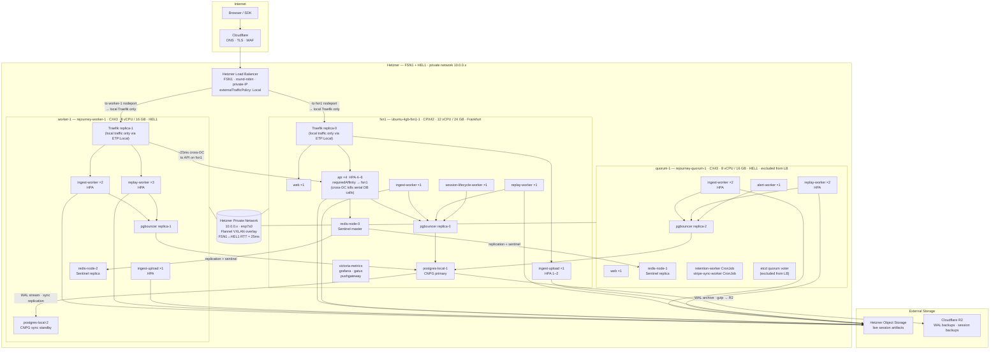
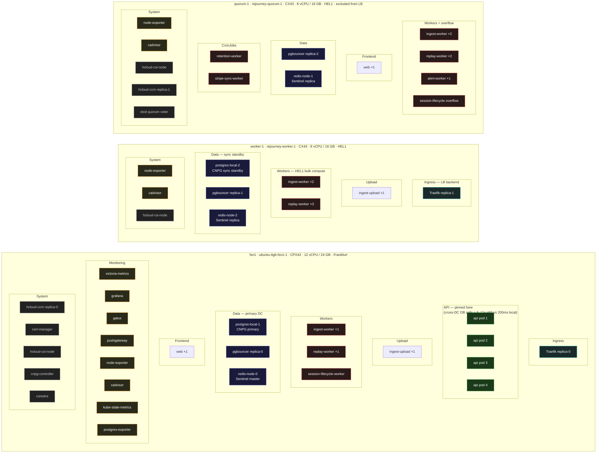

# All Things Cloud

Last updated: 2026-04-26 (HA fixes: CNPG sync replication, pgbouncer rolling update, CoreDNS HA)

This is the operator-facing map of production: network path, deploy flow, storage layout, monitoring, backups, HA failover, and every architectural decision behind where things run and why.

## Tailscale, public traffic, and admin access

**Public path:** Internet → **Cloudflare** (DNS / TLS / WAF) → **Hetzner Load Balancer** (FSN1, round-robin, private-IP backend) → **Traefik** (2 replicas: fsn1 + worker-1) → `rejourney.co`, `api.rejourney.co`, `ingest.rejourney.co`

**Admin path:** Operators join the **Tailscale tailnet** and use **SSH**, **kubectl**, and **kubectl port-forward** over `100.x` addresses. Admin UIs (Grafana, Traefik dashboard, Drizzle Studio) are not public.

**Important boundary:** Tailscale protects operator access to the node and cluster. It is not in the normal in-cluster service path. Internal traffic such as `Grafana → VictoriaMetrics` or `postgres-exporter → postgres-app-rw` stays on Kubernetes service networking.

Related docs:

- [admin-tools-private-access.md](./admin-tools-private-access.md)
- [rejourney-ci.md](./rejourney-ci.md)
- [legacy.md](./legacy.md)
- [postgres-backup-and-restore.md](./postgres-backup-and-restore.md)
- sibling repo `rejourney-internal/dev_docs/`

---

## Nodes

| Node | Hetzner type | DC | vCPU | RAM | Role | CPU requests |
|---|---|---|---|---|---|---|
| `ubuntu-4gb-fsn1-1` | CPX42 | FSN1 (Frankfurt) | 12 | 24 GB | Primary data + API | ~87% |
| `rejourney-worker-1` | CX43 | HEL1 (Helsinki) | 8 | 16 GB | Workers + standby DB | ~53% |
| `rejourney-quorum-1` | CX43 | HEL1 (Helsinki) | 8 | 16 GB | Workers + etcd quorum + overflow | ~49% |

**RTT between FSN1 and HEL1: ~25ms.** This is the single most important number in the architecture. Every serial cross-DC call adds 25ms. Presign endpoints make 5–10 serial DB calls — on a HEL1 API pod that means 125–250ms of pure wire overhead per request, compounding to 6–11s observed p50 before the fix.

**Node label gotcha:** the Kubernetes hostname label on the FSN1 node is `ubuntu-4gb-fsn1-1`, not `fsn1`. Pod affinity rules must use the actual label — using the Hetzner server name silently does nothing.

---

## Architecture

---

## Pod topology

Where every pod actually runs and why.

**Placement rationale by color:**
- **Green (API pods)** — pinned to FSN1 via node affinity (`preferred`, weight 100, hostname `ubuntu-4gb-fsn1-1`). Every API handler makes 5–10 serial DB + Redis calls; cross-DC adds 25ms per call, producing 6–11s observed p50 on HEL1 vs 140–200ms on FSN1.
- **Blue (data)** — CNPG primary and Redis master on FSN1, standbys on HEL1. pgbouncer on all three nodes so failover requires no reconfiguration.
- **Red (workers)** — bulk-compute workers spread across HEL1 to free FSN1 CPU for the API. Cross-DC DB latency is acceptable for async processing.
- **Cyan (ingress)** — Traefik on FSN1 and worker-1 only. quorum-1 is excluded from the Hetzner LB.
- **Orange (monitoring)** — all on FSN1 for simplicity. Goes offline if FSN1 fails — acceptable gap.

---

## Component decisions

### Hetzner Load Balancer

- Located in FSN1, round-robin across `fsn1` and `worker-1` backends only (`quorum-1` has `node.kubernetes.io/exclude-from-external-load-balancers: "true"`).
- Uses private IPs (`load-balancer.hetzner.cloud/use-private-ip: "true"`) so traffic stays inside the Hetzner private network.
- **`externalTrafficPolicy: Local` on the Traefik service** (set 2026-04-26). With `Cluster` (the default), kube-proxy on any node could VXLAN-forward to the other DC's Traefik pod before the request even hit Traefik — adding an invisible 25ms hop. `Local` forces kube-proxy to only route to a local Traefik pod. Since both `fsn1` and `worker-1` have a Traefik pod, no traffic is dropped.

### Traefik

- 2 replicas spread across `fsn1` and `worker-1` via pod anti-affinity. `quorum-1` is excluded so the LB never sends to it.
- Trusts Cloudflare IP ranges for `X-Forwarded-For` real IP passthrough on both `web` (port 80) and `websecure` (port 443) entry points.
- Middlewares in `rejourney` namespace: `https-redirect`, `http-www-redirect`, `www-redirect`, `security-headers`, `rate-limit-api` (1 000 req/min burst 5 000), `rate-limit-ingest` (20 000 req/min burst 40 000). Rate limits use `ipStrategy.excludedIPs` to skip Cloudflare proxy IPs and target the real client IP.
- Metrics exposed on a separate `metrics` entry point (not externally routed) and scraped by VictoriaMetrics.
- When Hetzner LB sends to `worker-1` Traefik, that Traefik routes to the `api` ClusterIP which load-balances to any API pod. Since all API pods are pinned to FSN1, this means every request via the HEL1 Traefik crosses ~25ms to the API. That is the unavoidable HA tradeoff — the alternative is no API availability when FSN1 goes down.

### API (`api.rejourney.co`)

- **Node affinity: `preferredDuringSchedulingIgnoredDuringExecution`, weight 100, hostname `ubuntu-4gb-fsn1-1`.** This is preferred (not required) so pods can overflow to HEL1 if FSN1 is full or down — maintaining HA.
- **`topologySpreadConstraints` removed (2026-04-26).** The spread constraint (maxSkew: 1 across nodes) was scoring against the affinity, causing pods to land on HEL1 nodes in normal operation. The constraint description in the old code was aspirational, not accurate.
- **Critical gotcha (fixed 2026-04-26):** the original affinity targeted hostname `"fsn1"` which does not match any node label. The real hostname label is `"ubuntu-4gb-fsn1-1"`. The affinity silently did nothing for months, causing pods to spread to HEL1 where each presign call (5–10 serial DB queries) accumulated 25ms × N = 6–11s observed p50. Fixed to use the correct label.
- HPA: min 4, max 6, target 65% CPU. With 4 pods on FSN1 the node sits at ~87% CPU requests — headroom is tight but requests ≠ actual usage (observed ~48% actual CPU).
- Connects to: `pgbouncer` ClusterIP (→ CNPG primary), `redis` ClusterIP (Sentinel, master on `redis-node-0`), Hetzner S3 for presigned URL generation.
- `DB_POOL_MAX=50` per pod against pgbouncer; pgbouncer caps the actual postgres connections.

### `ingest-upload`

- Receives raw session upload chunks and streams them to Hetzner S3.
- HPA: min 1, max 2, target 70% CPU. Currently running at 78% — near the scale-out threshold.
- 2 replicas spread across `fsn1` and `worker-1`. Does not need DB affinity (S3-only writes), so cross-DC placement is fine.

### `ingest-worker`, `replay-worker`

- CPU-heavy background workers — intentionally spread across `worker-1` and `quorum-1` to leave FSN1 headroom for the latency-sensitive API.
- `ingest-worker`: HPA 5–6 pods. `replay-worker`: HPA 1–6 pods (currently at 6, CPU 96% of 55% target — actively scaling).
- Both connect to `pgbouncer` and Hetzner S3. Cross-DC latency to pgbouncer→postgres is acceptable for batch/async work.

### `alert-worker`, `session-lifecycle-worker`

- Single-replica workers. `alert-worker` on `quorum-1`, `session-lifecycle-worker` on `quorum-1`.
- `session-lifecycle-worker` connects through `pgbouncer` on FSN1 (via ClusterIP).

### `retention-worker`, `stripe-sync-worker`

- CronJobs running on `quorum-1`. Periodic, not latency-sensitive.

### `web` (`rejourney.co`)

- 2 replicas: one on `fsn1`, one on `quorum-1`. Static/SSR frontend — no DB affinity needed.

### pgbouncer

- 3 replicas, one per node. All connect to `postgres-app-rw` which uses a live CNPG label selector (`cnpg.io/instanceRole: primary`) — always resolves to the current primary regardless of which CNPG instance is promoted.
- `internalTrafficPolicy: Local` — each pod on a given node uses only its local pgbouncer replica. Reduces latency and avoids cross-node pgbouncer hops.
- Pod anti-affinity: `preferred` weight 100 on hostname — one per node in steady state, but allows a temporary surge pod to co-locate during rolling updates. **Previously `required`**, which caused the surge pod to stay Pending forever (no 4th node exists) stalling all pgbouncer deploys and creating a 10–30s window where the rolling-replaced node had no local pgbouncer endpoint, dropping connections for pods on that node (fixed 2026-04-26).
- Rolling update: `maxSurge: 1, maxUnavailable: 0` — new pod starts and becomes ready before old pod is removed. No gap in local endpoint coverage (fixed 2026-04-26).
- When FSN1 fails and CNPG promotes `postgres-local-2` (worker-1), the HEL1 pgbouncer replicas redirect to the new primary locally — zero cross-DC DB latency in failover.

### CNPG (postgres-local)

- 2-instance cluster: `postgres-local-1` (primary, FSN1) + `postgres-local-2` (sync standby, worker-1).
- **Sync replication: `minSyncReplicas: 1`, `maxSyncReplicas: 1`, `synchronous_commit = remote_write`** (enabled 2026-04-26). Primary waits for the standby to confirm WAL is written to its OS buffer before acking a commit. Adds ~25ms to write transactions (one FSN1→HEL1 RTT). Read-only transactions are unaffected. `maxSyncReplicas: 1` ensures postgres does NOT block writes if the standby is temporarily down (e.g., during CNPG rolling upgrade) — it degrades to async rather than stalling indefinitely. The full safety guarantee: no committed write is lost on a hard FSN1 failure, with one small caveat — a simultaneous crash of both FSN1 and the standby's OS (before fsync) would lose the last write. Accepted tradeoff vs full `synchronous_commit = on`.
- WAL archived to Cloudflare R2 (gzip). Restores use `postgres-backup-and-restore.md`.
- Storage: `rejourney-db-local-retain` StorageClass (`rancher.io/local-path` provisioner, `reclaimPolicy: Retain`). Data lives on the node's local disk. **Note: these are NOT Hetzner cloud volumes** — the Hetzner CSI driver is installed but unused for DB storage. With `Retain`, PVCs are not deleted when pods/clusters are deleted, but if the physical node is permanently gone, the local data on that node is gone too. The standby on worker-1 is the recovery path for permanent FSN1 loss; R2 WAL archive is the last resort.
- CNPG controller runs on FSN1. If FSN1 fails, the CNPG controller goes offline — the standby auto-promotes via its own HA logic without needing the controller, but no new cluster operations (backups, config changes) can be issued until FSN1 recovers or the controller reschedules.

### Redis (Sentinel mode)

- 3-node StatefulSet: `redis-node-0` (FSN1, Sentinel master), `redis-node-1` (quorum-1, replica), `redis-node-2` (worker-1, replica).
- Each node has a 8 GiB Hetzner volume (`reclaimPolicy: Retain`).
- Sentinel quorum = 2 out of 3 nodes. If FSN1 goes down, the two HEL1 Sentinel instances elect a new master from the replicas — API pods that reschedule to HEL1 will find a local Redis master.
- All API pods connect through the `redis` ClusterIP service (which routes to the current Sentinel master, port 26379 for Sentinel discovery, port 6379 for data).

### Monitoring stack (all on FSN1)

| Component | Purpose |
|---|---|
| VictoriaMetrics | Long-term metrics store. Scraped by pull from node-exporter, cadvisor, kube-state-metrics, postgres-exporter, redis-metrics, Traefik, pushgateway. |
| Grafana | Dashboard UI. Port-forwarded for operator access (`kubectl port-forward`). |
| Gatus | Uptime / health check. Monitors public endpoints and internal services. |
| Pushgateway | Accepts push metrics from CronJobs and short-lived pods (retention-worker, stripe-sync). |
| node-exporter | DaemonSet — one pod per node. |
| cadvisor | DaemonSet — one pod per node. |
| kube-state-metrics | Cluster-level Kubernetes object metrics. |
| postgres-exporter | Scrapes CNPG primary for pg_stat_statements and connection metrics. |
| CoreDNS | 2 replicas (1 on FSN1, 1 on HEL1) via HelmChartConfig. With 1 replica (k3s default), FSN1 failure causes 30–60s cluster-wide DNS outage blocking all reconnects (fixed 2026-04-26). |

### cert-manager

- Runs on FSN1. Issues Let's Encrypt TLS certs for `rejourney.co`, `www.rejourney.co`, `api.rejourney.co`, `ingest.rejourney.co` via the `letsencrypt-prod` ClusterIssuer.
- Certs stored as Kubernetes Secrets (`rejourney-api-tls`, `rejourney-web-tls`) and mounted by Traefik.

### hcloud Cloud Controller Manager (CCM)

- 2 replicas for HA: one on FSN1, one on `quorum-1`.
- Responsible for provisioning the Hetzner Load Balancer and attaching nodes as backends. Also manages Hetzner volume attachment for CSI.

### Storage classes

| Class | Driver | Reclaim policy | Used by |
|---|---|---|---|
| `rejourney-db-local-retain` | hcloud-csi | Retain | postgres-local-1, postgres-local-2, redis-node-0/1/2 |
| `local-path` | local-path-provisioner | Delete | grafana, victoria-metrics, gatus, pgadmin, cloudbeaver, uptime-kuma |

**The Retain policy on DB volumes is critical.** If a PVC or pod is deleted, the underlying Hetzner volume is not deleted — it must be manually cleaned up via the Hetzner API or console. Recreating a CNPG cluster or Redis StatefulSet without first verifying volumes will silently create orphan paid volumes.

---

## HA failover behavior

| FSN1 failure | What happens |
|---|---|
| API pods | Reschedule to HEL1 (preferred, not required affinity). Slow (~25ms/DB call) until postgres and Redis failovers complete. |
| CNPG primary | `postgres-local-2` (worker-1) auto-promotes via CNPG HA (no controller needed). `postgres-app-rw` selector follows the new primary label automatically. pgbouncer on HEL1 reconnects. |
| In-flight writes at crash | **No data loss** — `minSyncReplicas: 1` + `synchronous_commit = remote_write` means every committed write was already buffered on the standby before the primary acked it. |
| Redis master | Sentinel quorum (quorum-1 + worker-1) elects new master from existing replicas. Happens within seconds, before API pods finish rescheduling. |
| Traefik FSN1 | LB continues routing to `worker-1` Traefik only. All ingest/replay workers on HEL1 stay unaffected. |
| CoreDNS | Second replica on HEL1 keeps DNS alive. No DNS outage (fixed 2026-04-26 — was the biggest silent failure mode). |
| CNPG controller | Goes offline with FSN1. Standby still promotes without it. No new cluster operations (backup schedule, config changes) until controller reschedules or FSN1 recovers. |
| Monitoring | Victoria-metrics, Grafana, Gatus go offline. No alerts during outage — gap in metrics. Known gap, accepted. |

**Post-FSN1-failover latency:** once CNPG promotes (~30s) and Redis elects a master (~5s), HEL1 API pods hit local pgbouncer → local postgres primary → local Redis master. Latency recovers to near-FSN1 levels. The 25ms cross-DC overhead disappears.

---

## Ingress routing map

| Host | Path | Backend | Middlewares |
|---|---|---|---|
| `rejourney.co` | `/` | `web:80` | security-headers |
| `www.rejourney.co` | `/` (HTTP) | `web:80` | http-www-redirect |
| `www.rejourney.co` | `/` (HTTPS) | `web:80` | www-redirect |
| `api.rejourney.co` | `/api/ingest`, `/api/sdk/config` | `api:3000` | security-headers, rate-limit-ingest |
| `api.rejourney.co` | `/` | `api:3000` | security-headers, rate-limit-api |
| `ingest.rejourney.co` | `/upload` | `ingest-upload:3001` | security-headers, rate-limit-ingest |
| `ingest.rejourney.co` | `/` | `api:3000` | security-headers, rate-limit-ingest |
| `*.rejourney.co` (HTTP) | `/` | — | https-redirect |

---

## Key operational gotchas

1. **API affinity hostname must be `ubuntu-4gb-fsn1-1`** — not `fsn1`, not the Hetzner display name. The scheduler silently ignores an affinity that matches no node. (Was wrong for months; fixed 2026-04-26.)
2. **Do not re-add `topologySpreadConstraints` to the API deployment** without also raising the affinity weight significantly. Tested: maxSkew:1 ScheduleAnyway overrides a weight-80 preference and spreads pods to HEL1, where serial DB calls cause 6–11s p50 response times.
3. **Do not change `externalTrafficPolicy` back to `Cluster`** — adds a kube-proxy VXLAN hop before every Traefik request, invisibly adding up to 25ms to 50% of inbound traffic.
4. **DB storage is local-path, not Hetzner cloud volumes** — `rejourney-db-local-retain` uses `rancher.io/local-path`. PVCs survive pod/cluster deletion (Retain), but if the physical node is permanently destroyed, the local data on that node is gone. The standby and R2 WAL archive are the recovery paths.
5. **quorum-1 is excluded from the Hetzner LB** via `node.kubernetes.io/exclude-from-external-load-balancers: "true"`. Traefik only runs on `fsn1` and `worker-1`. Do not remove this label.
6. **pgbouncer anti-affinity is `preferred`, not `required`** — intentionally, to allow the `maxSurge: 1` pod to temporarily co-locate during rolling updates. In steady state, the scheduler maintains one per node. Changing to `required` will stall every pgbouncer deploy.
7. **CNPG sync replication degrades to async when standby is down** — `maxSyncReplicas: 1` means postgres won't block writes if the standby is temporarily unavailable. This is intentional. During CNPG upgrades or standby restarts, you briefly lose the sync guarantee. If FSN1 crashes in that window, the last few writes may be lost.
8. **replay-worker is saturated** (96% CPU vs 55% target, at max 6 replicas as of 2026-04-26). If replay backlog grows, this is the bottleneck.
