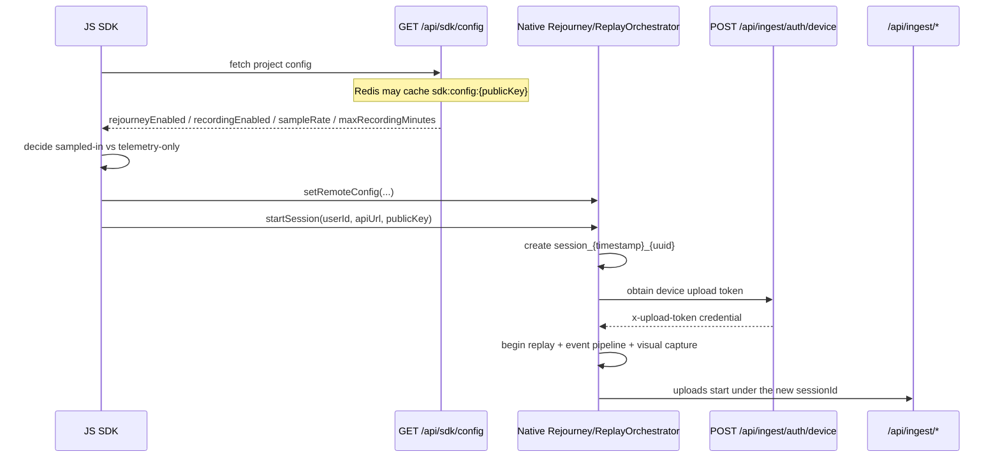
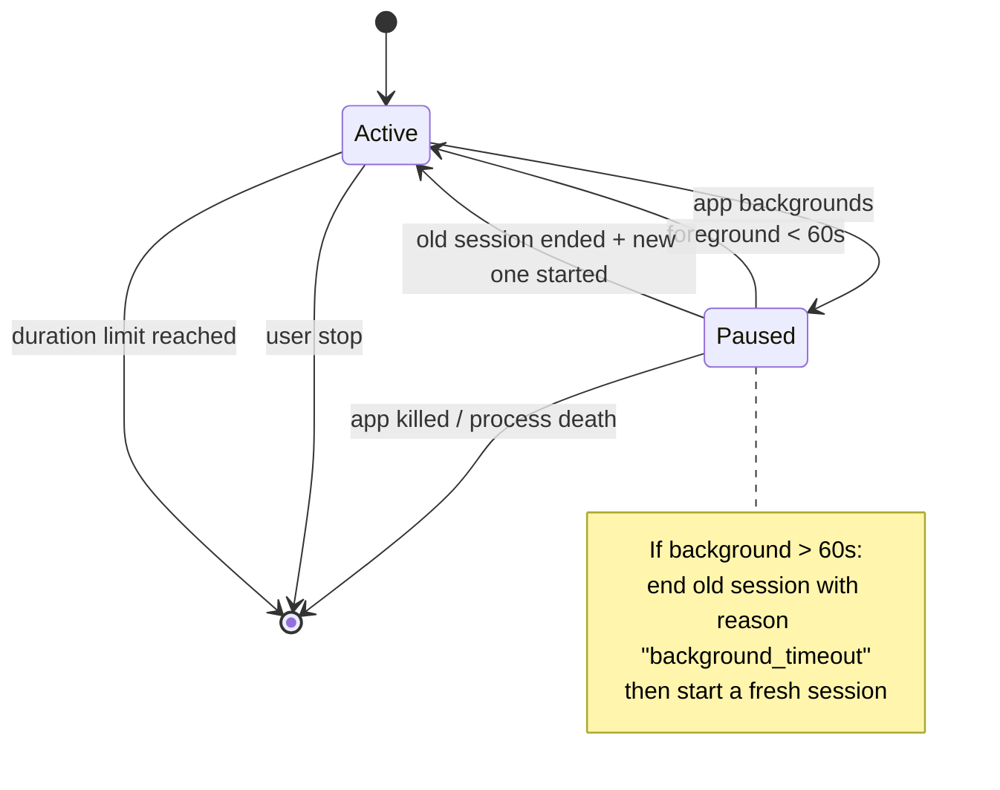
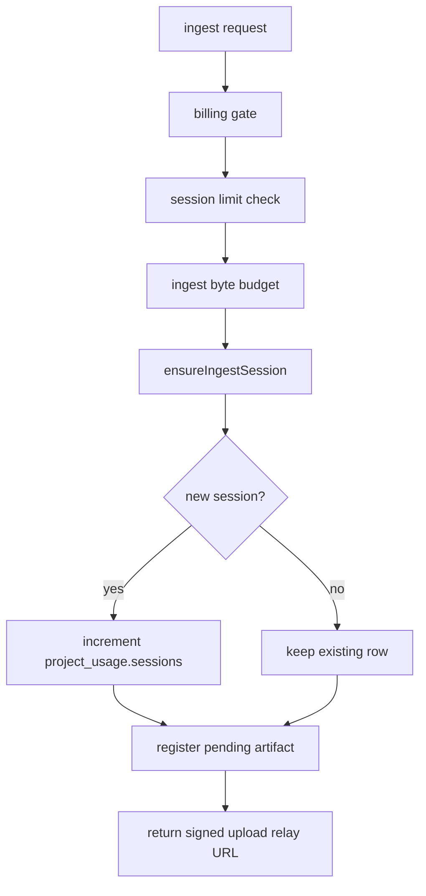
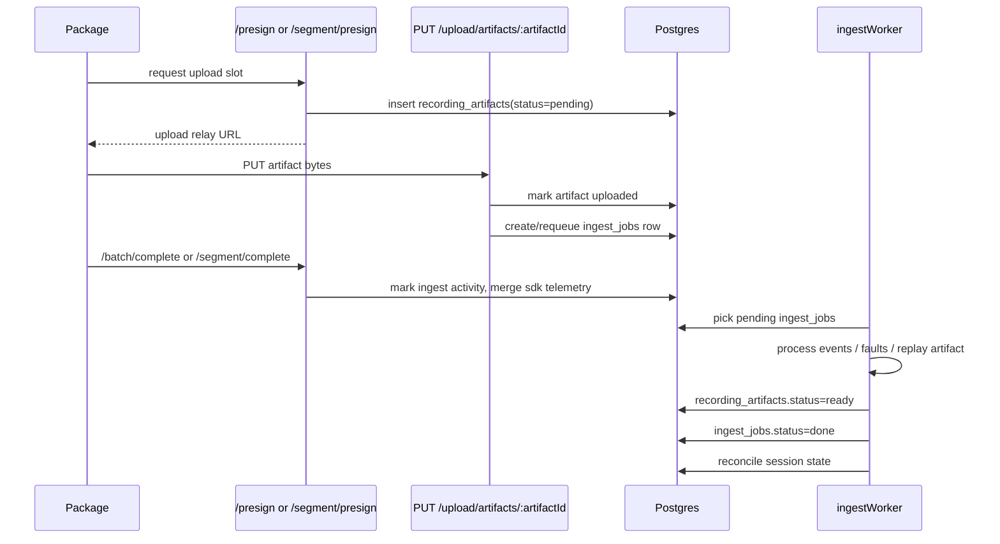
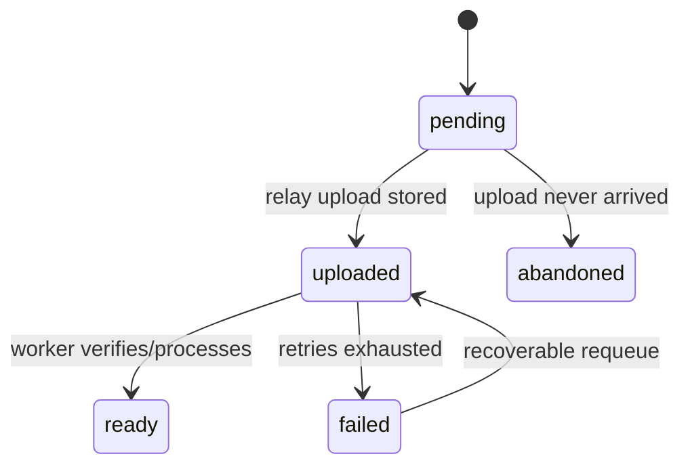
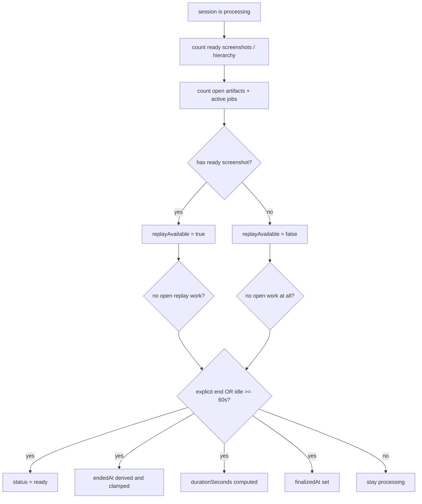

# Ingest + Session Recording Lifecycle (Visual)

Last updated: 2026-03-25

This doc describes how the React Native package, ingest API, Redis, Postgres, and the ingest worker fit together for session recording.

The shortest correct mental model is:

- The package usually creates a client-side `session_{timestamp}_{uuid}` ID and starts uploading artifacts under that ID.
- Postgres is the source of truth for session state, artifact state, jobs, metrics, and usage.
- Redis is a runtime helper for caching, idempotency, and rate/limit coordination.
- A session becomes replay-available when at least one screenshot artifact reaches `ready`.
- A session becomes finalized when reconciliation sees no blocking work and either an explicit end or enough idle time.

---

## Flow Index

```text
┌──────────────────────────────────────────────────────────────────────────────┐
│ [R1] Package Start / Rollover                                                │
│ [R2] Upload Lanes (events + replay artifacts)                                │
│ [R3] Artifact Relay + Worker                                                 │
│ [R4] Session Reconciliation / Auto-Finalizer                                 │
│ [R5] Redis vs Postgres Ownership                                             │
│ [R6] Quick Answers                                                           │
└──────────────────────────────────────────────────────────────────────────────┘
```

---

## [R1] Package Start / Rollover



### Package-side rules that matter downstream

- In the normal React Native flow, the session ID is generated on-device in the package.
- There is still a backend fallback for event-style `/presign` requests with no `sessionId`, which creates `session_${randomHex}`.
- The timestamp embedded in the session ID is later used by the backend to infer `started_at`.
- JS fetches [`/api/sdk/config`](/Users/mora/Desktop/Dev-mac/rejourney/backend/src/routes/sdk.ts) before starting and can disable replay entirely before any visual upload happens.
- Native obtains an upload credential from [`/api/ingest/auth/device`](/Users/mora/Desktop/Dev-mac/rejourney/backend/src/routes/ingestDeviceAuth.ts) and sends it as `x-upload-token`.
- Android and iOS both persist a recovery checkpoint so interrupted sessions can be finalized on the next launch.

### Package-side rollover / stop paths



Important package timers / triggers:

- Background timeout for rollover: `60s`
- Grace window before forced restart after timeout: `2s`
- Event heartbeat flush: `5s`
- Max recording duration: comes from backend config, clamped server-side to `1..10` minutes

Relevant code:

- [`packages/react-native/src/index.ts`](/Users/mora/Desktop/Dev-mac/rejourney/packages/react-native/src/index.ts)
- [`packages/react-native/android/src/main/java/com/rejourney/recording/ReplayOrchestrator.kt`](/Users/mora/Desktop/Dev-mac/rejourney/packages/react-native/android/src/main/java/com/rejourney/recording/ReplayOrchestrator.kt)
- [`packages/react-native/android/src/main/java/com/rejourney/recording/TelemetryPipeline.kt`](/Users/mora/Desktop/Dev-mac/rejourney/packages/react-native/android/src/main/java/com/rejourney/recording/TelemetryPipeline.kt)
- [`packages/react-native/android/src/main/java/com/rejourney/engine/DeviceRegistrar.kt`](/Users/mora/Desktop/Dev-mac/rejourney/packages/react-native/android/src/main/java/com/rejourney/engine/DeviceRegistrar.kt)

---

## [R2] Upload Lanes

```text
               same sessionId
                     │
     ┌───────────────┴────────────────┐
     │                                │
     ▼                                ▼
Events lane                     Replay lane
POST /presign                   POST /segment/presign
PUT relay upload                PUT relay upload
POST /batch/complete            POST /segment/complete
     │                                │
     └───────────────┬────────────────┘
                     ▼
              recording_artifacts
```

### What `/presign` and `/segment/presign` do



### Notes

- Both lanes call [`ensureIngestSession()`](/Users/mora/Desktop/Dev-mac/rejourney/backend/src/services/ingestSessionLifecycle.ts).
- New sessions are inserted with `status='processing'` and a matching `session_metrics` row.
- If a late artifact appears for a finalized session, [`registerPendingArtifact()`](/Users/mora/Desktop/Dev-mac/rejourney/backend/src/services/ingestArtifactLifecycle.ts) reopens it via `markSessionIngestActivity(..., reopen: true)`.
- Billing/session counting happens only when the session row is first created.
- Replay screenshot uploads are rejected if the project disables recording or the session is sampled out.

Relevant routes:

- [`backend/src/routes/ingestUploads.ts`](/Users/mora/Desktop/Dev-mac/rejourney/backend/src/routes/ingestUploads.ts)
- [`backend/src/routes/ingestLifecycle.ts`](/Users/mora/Desktop/Dev-mac/rejourney/backend/src/routes/ingestLifecycle.ts)

---

## [R3] Artifact Relay + Worker



### Artifact state machine



### What the worker actually derives

- `events` artifacts update session metadata and `session_metrics`, plus errors/ANRs/heatmap/daily stats side effects.
- `crashes` and `anrs` artifacts create issue records and increment crash/ANR counters.
- `screenshots` and `hierarchy` artifacts are mostly verification/normalization steps; once `ready`, they feed replay availability and finalization.

Worker sweep behavior:

- Every `10s`, the ingest worker runs a reconciliation sweep.
- `pending` artifacts older than `10m` can become `abandoned`.
- `processing` jobs older than `5m` can be requeued.
- `uploaded` artifacts missing usable jobs can be recovered into the queue.

Relevant code:

- [`backend/src/routes/ingestUploadRelay.ts`](/Users/mora/Desktop/Dev-mac/rejourney/backend/src/routes/ingestUploadRelay.ts)
- [`backend/src/services/ingestArtifactLifecycle.ts`](/Users/mora/Desktop/Dev-mac/rejourney/backend/src/services/ingestArtifactLifecycle.ts)
- [`backend/src/worker/ingestWorker.ts`](/Users/mora/Desktop/Dev-mac/rejourney/backend/src/worker/ingestWorker.ts)

---

## [R4] Session Reconciliation / Auto-Finalizer



### The important nuance

- Replay availability is artifact-driven, not `/session/end`-driven.
- Finalization is also artifact-driven, with `/session/end` acting as a strong signal, not the only trigger.
- Once screenshots are ready, late `events`/`faults` uploads do not block replay readiness; only open replay artifacts/jobs still block finalization.

### Canonical replay fields

The canonical replay lifecycle fields in Postgres are:

- `sessions.replay_available`
- `sessions.replay_available_at`

These are the fields the server uses for:

- replay list filtering
- replay bootstrap gating
- artifact-driven reconciliation

The older `replay_promoted*` and `replay_promotion_score` columns were legacy aliases. They are no longer persisted in the database.

For API/frontend compatibility, the server still returns:

- `replayPromoted`
- `replayPromotedReason`
- `replayPromotionScore`

but those are now synthesized from the canonical replay availability state instead of being read from session columns.

### Auto-finalizer in plain English

The "auto-finalizer" is not a separate cron service. It is the ingest worker sweep calling [`reconcileDueSessions()`](/Users/mora/Desktop/Dev-mac/rejourney/backend/src/services/sessionReconciliation.ts).

It finalizes a `processing` session when:

- there is no blocking work left, and
- either:
  - `/api/ingest/session/end` already set `explicit_ended_at`, or
  - the session has been idle for `60s`

### How `endedAt` is chosen

Finalization derives `ended_at` from this priority order:

1. `explicit_ended_at`
2. latest replay artifact `end_time`
3. `last_ingest_activity_at`
4. existing `ended_at`
5. `now`

Then it clamps the result to:

- no earlier than `started_at`
- no later than `started_at + maxRecordingMinutes + 2 minutes`

### What `/session/end` really does

```text
/api/ingest/session/end
  -> resolveLifecycleSession()
  -> upsert session_metrics
  -> merge metrics + sdk telemetry
  -> compute wall clock / background / playable duration for logging
  -> markSessionIngestActivity(explicitEndedAt=..., closeSource='explicit')
  -> reconcileSessionState()
```

### Missing session on `/session/end`?

Yes, the backend can still create it.

If `/session/end` or `/replay/evaluate` arrives for a missing session ID that is still "fresh", the backend materializes the session on the fly.

Fresh means:

- session ID parses as `session_{timestamp}_{uuid}`
- timestamp is no more than `6h` old

This is handled by [`resolveLifecycleSession()`](/Users/mora/Desktop/Dev-mac/rejourney/backend/src/services/ingestSessionLifecycle.ts).

---

## [R5] Redis vs Postgres Ownership

```mermaid
flowchart LR
    subgraph Redis["Redis (runtime helper plane)"]
        R1[sdk:config:*]
        R2[ingest:idempotency:*]
        R3[sessions:{teamId}:{period}]
        R4[session_lock:{teamId}:{period}]
        R5[upload:token:{projectId}:{deviceId}]
    end

    subgraph PG["Postgres (source of truth)"]
        P1[sessions]
        P2[session_metrics]
        P3[recording_artifacts]
        P4[ingest_jobs]
        P5[project_usage]
        P6[device_usage]
    end
```

### Redis owns

- SDK config cache
- ingest idempotency markers
- session-limit cache plus distributed lock
- best-effort upload token storage
- rate limiting helpers

### Postgres owns

- whether a session exists
- session lifecycle fields such as `status`, `started_at`, `explicit_ended_at`, `finalized_at`, `last_ingest_activity_at`
- replay availability
- artifact state
- worker job state
- metrics and derived analytics counters
- project/device usage counters

### Practical consequence

If Redis is slow or unavailable, ingest can usually fall back and keep working.

If Postgres is wrong, the session lifecycle is wrong.

Schema anchors:

- [`backend/src/db/schema.ts`](/Users/mora/Desktop/Dev-mac/rejourney/backend/src/db/schema.ts)
- [`backend/src/db/redis.ts`](/Users/mora/Desktop/Dev-mac/rejourney/backend/src/db/redis.ts)

---

## [R6] Quick Answers

### When is a new session created?

Usually on the first successful:

- `POST /api/ingest/presign`, or
- `POST /api/ingest/segment/presign`

If `/api/ingest/presign` arrives without a `sessionId`, the backend can also mint one itself.

It can also be lazily materialized later during:

- `POST /api/ingest/session/end`
- `POST /api/ingest/replay/evaluate`

if the session ID is fresh enough and still missing.

### What exactly is the auto-finalizer?

The ingest worker sweep plus [`reconcileSessionState()`](/Users/mora/Desktop/Dev-mac/rejourney/backend/src/services/sessionReconciliation.ts).

It is artifact-aware and idle-aware, not just "call `/session/end` and mark done".

### What makes a replay visible?

At least one screenshot artifact in `recording_artifacts` reaches `status='ready'`.

Hierarchy alone is not enough.

### Can a finalized session reopen?

Yes.

Any later `registerPendingArtifact()` call touches the session with `reopen: true`, which clears `finalized_at` and moves it back to `processing`.

### Does Redis store session lifecycle state?

No.

Redis helps the pipeline run smoothly, but Postgres owns the actual lifecycle.

---

## Constant Sheet

```text
Session ID materialization window      6h
Finalize idle threshold                60s
Worker reconciliation sweep            10s
Pending artifact abandonment           10m
Stale processing job retry window      5m
Upload relay token TTL                 1h
SDK background rollover threshold      60s
SDK rollover grace window              2s
SDK event heartbeat                    5s
```

---

## Primary Files

- [`backend/src/routes/ingestUploads.ts`](/Users/mora/Desktop/Dev-mac/rejourney/backend/src/routes/ingestUploads.ts)
- [`backend/src/routes/ingestLifecycle.ts`](/Users/mora/Desktop/Dev-mac/rejourney/backend/src/routes/ingestLifecycle.ts)
- [`backend/src/routes/ingestUploadRelay.ts`](/Users/mora/Desktop/Dev-mac/rejourney/backend/src/routes/ingestUploadRelay.ts)
- [`backend/src/routes/ingestDeviceAuth.ts`](/Users/mora/Desktop/Dev-mac/rejourney/backend/src/routes/ingestDeviceAuth.ts)
- [`backend/src/services/ingestSessionLifecycle.ts`](/Users/mora/Desktop/Dev-mac/rejourney/backend/src/services/ingestSessionLifecycle.ts)
- [`backend/src/services/ingestArtifactLifecycle.ts`](/Users/mora/Desktop/Dev-mac/rejourney/backend/src/services/ingestArtifactLifecycle.ts)
- [`backend/src/services/sessionReconciliation.ts`](/Users/mora/Desktop/Dev-mac/rejourney/backend/src/services/sessionReconciliation.ts)
- [`backend/src/worker/ingestWorker.ts`](/Users/mora/Desktop/Dev-mac/rejourney/backend/src/worker/ingestWorker.ts)
- [`packages/react-native/src/index.ts`](/Users/mora/Desktop/Dev-mac/rejourney/packages/react-native/src/index.ts)
- [`packages/react-native/android/src/main/java/com/rejourney/recording/ReplayOrchestrator.kt`](/Users/mora/Desktop/Dev-mac/rejourney/packages/react-native/android/src/main/java/com/rejourney/recording/ReplayOrchestrator.kt)
- [`packages/react-native/android/src/main/java/com/rejourney/recording/TelemetryPipeline.kt`](/Users/mora/Desktop/Dev-mac/rejourney/packages/react-native/android/src/main/java/com/rejourney/recording/TelemetryPipeline.kt)
- [`packages/react-native/android/src/main/java/com/rejourney/engine/DeviceRegistrar.kt`](/Users/mora/Desktop/Dev-mac/rejourney/packages/react-native/android/src/main/java/com/rejourney/engine/DeviceRegistrar.kt)
