# Storage Endpoints Visual Guide

Diagram-first reference for multi-bucket, project-scoped endpoints, shadow replication, backup, and retention safety.

---

## 1) System Map

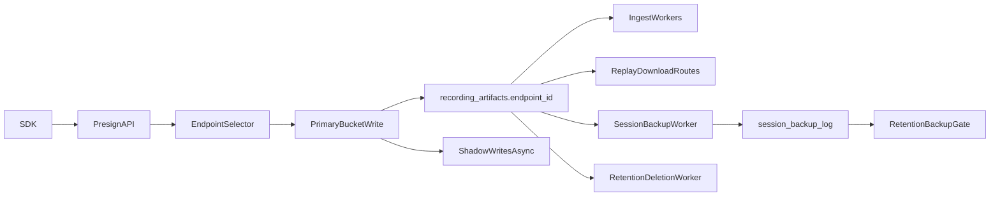

---

## 2) Endpoint Resolution Rules

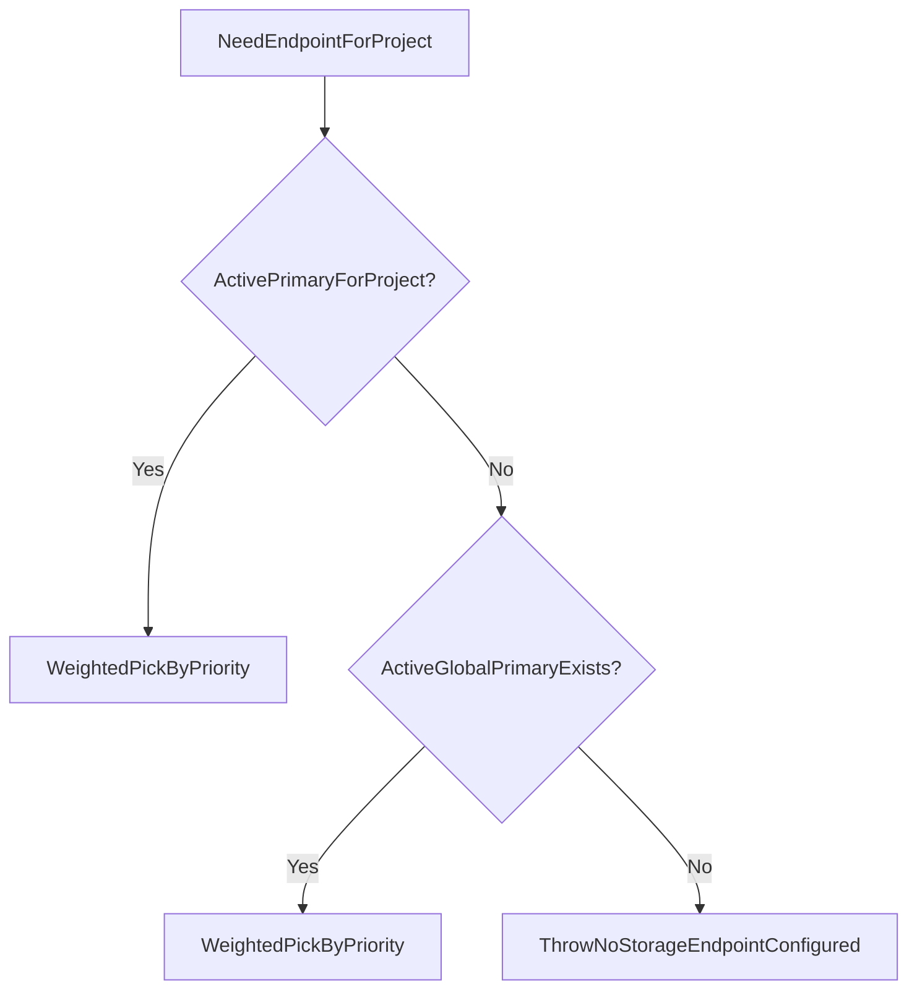

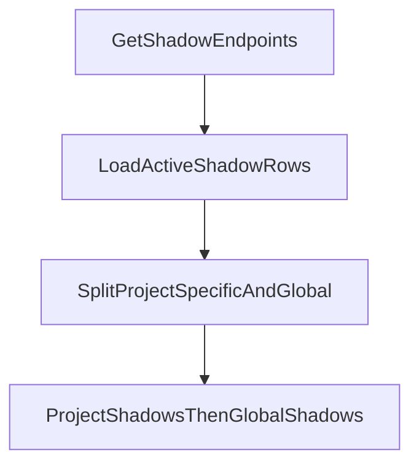

Notes:
- `shadow=false` rows are primary candidates.
- `shadow=true` rows receive async replica writes only.
- `project_id=NULL` means global default scope.

---

## 3) Data Model (Storage-Critical)

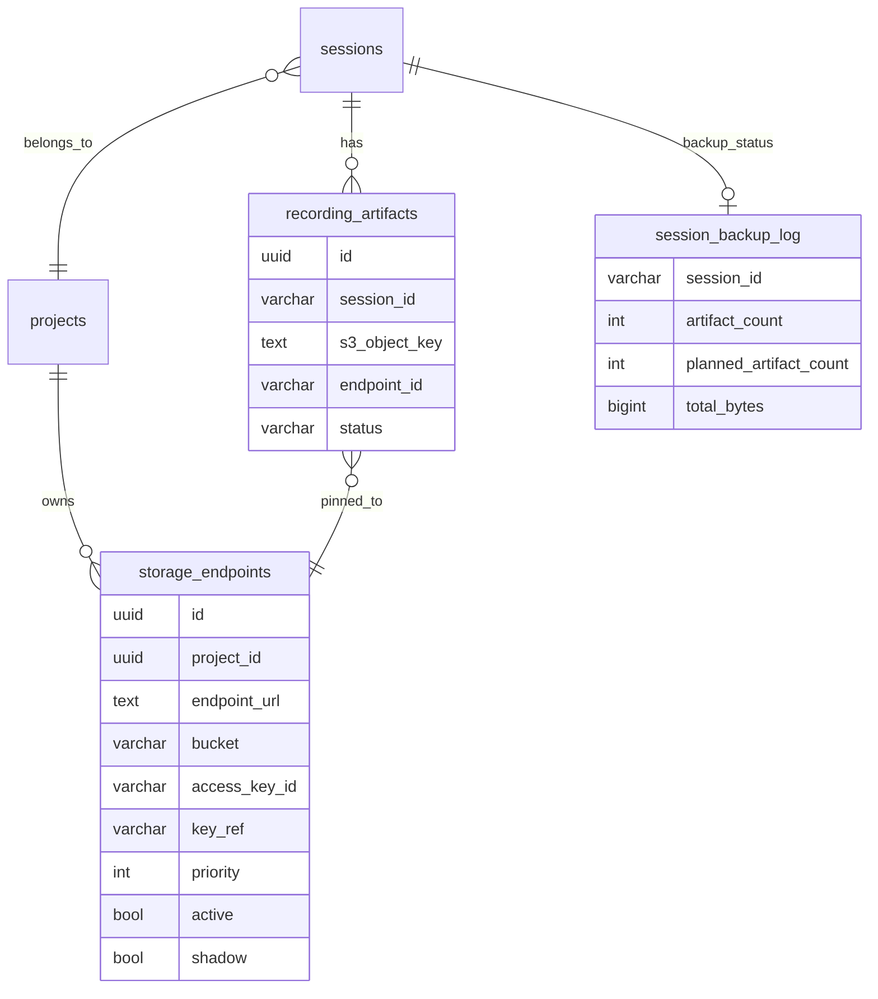

---

## 4) Ingest + Upload Sequence

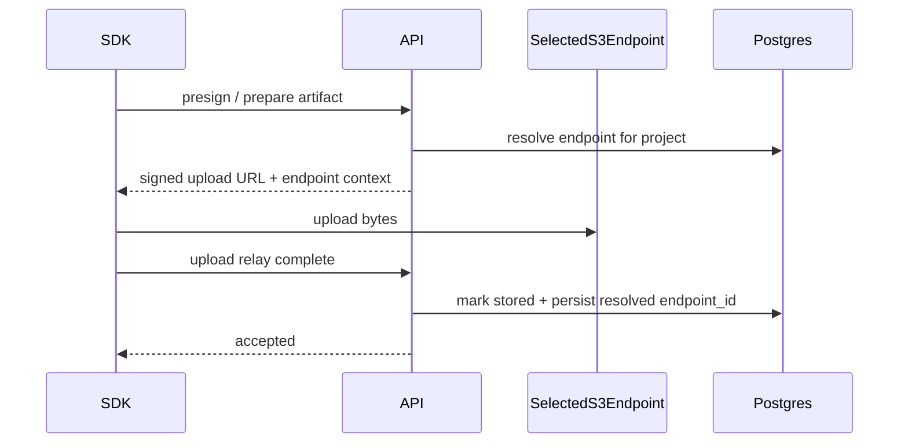

Critical behavior:
- If upload fallback picks a different endpoint, stored `endpoint_id` is updated to actual endpoint used.

---

## 5) Backup Worker (Current Safe Model)

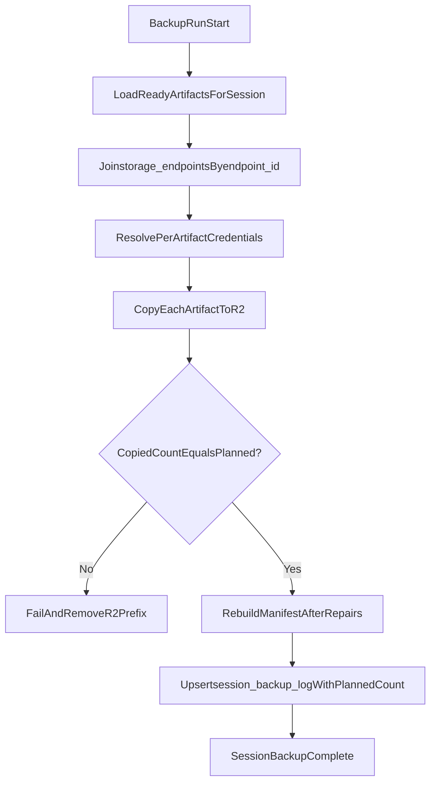

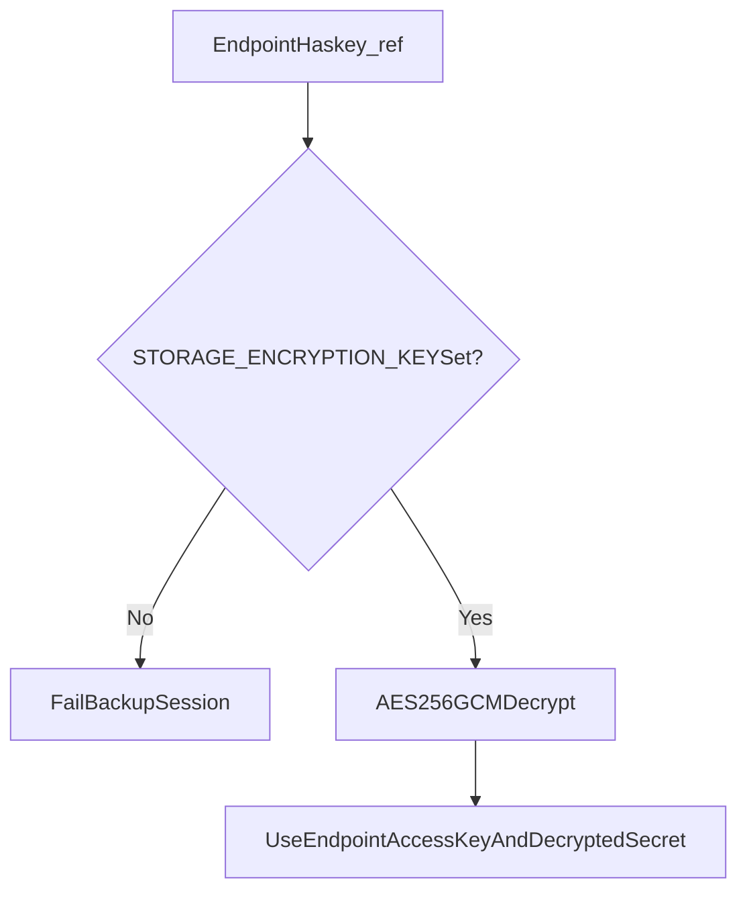

Backup completeness contract:
- Backup row now stores both:
  - `artifact_count` (copied)
  - `planned_artifact_count` (expected)
- Session backup is only considered successful when copied equals planned.

---

## 6) Retention + Deletion Safety

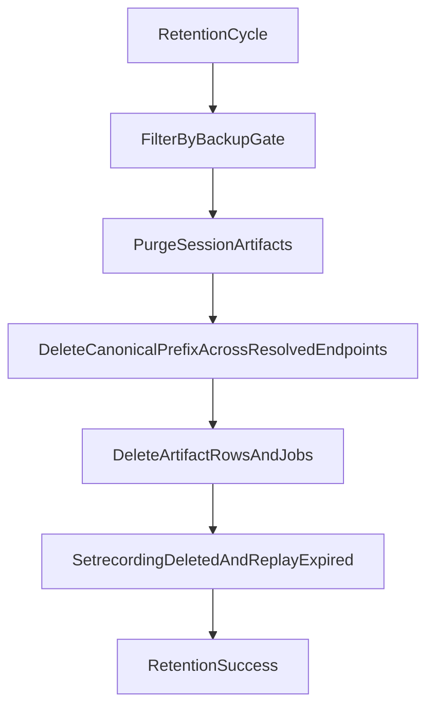

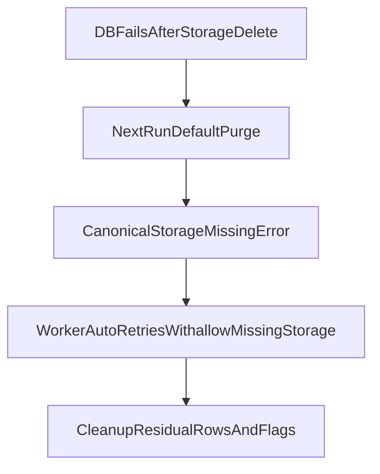

Deletion hardening now in place:
- Rejects foreign endpoint IDs during endpoint resolution for project purge.
- Fails if S3 `DeleteObjects` returns per-object errors (no silent partial success accounting).
- Retention worker auto-recovers missing-storage replay with repair mode.

---

## 7) Backup Gate Logic

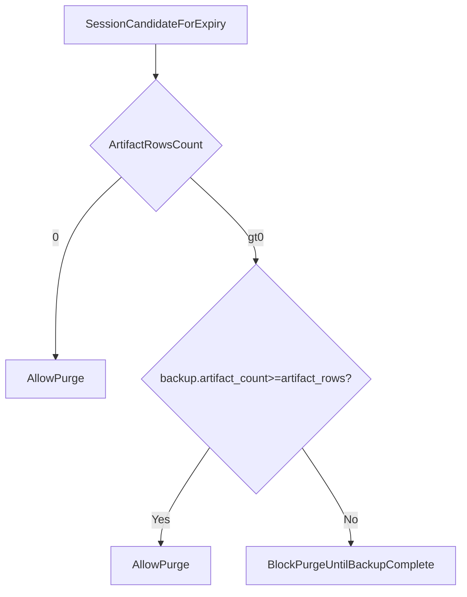

This prevents `artifact_count > 0` partial backups from passing gate checks.

---

## 8) Replay Read Path

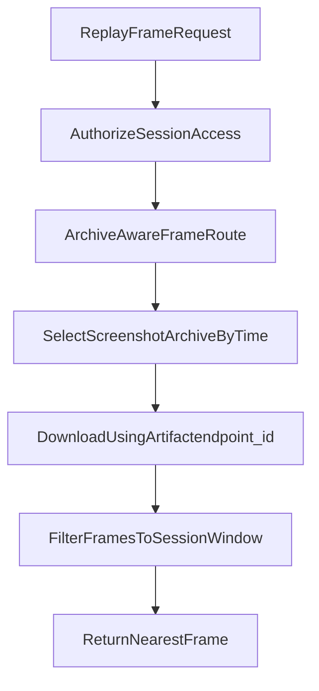

Compatibility behavior:
- Legacy frame proxy route redirects to archive-aware route.
- Artifact-specific signed URLs are used when endpoint pinning exists.

---

## 9) Scope Matrix

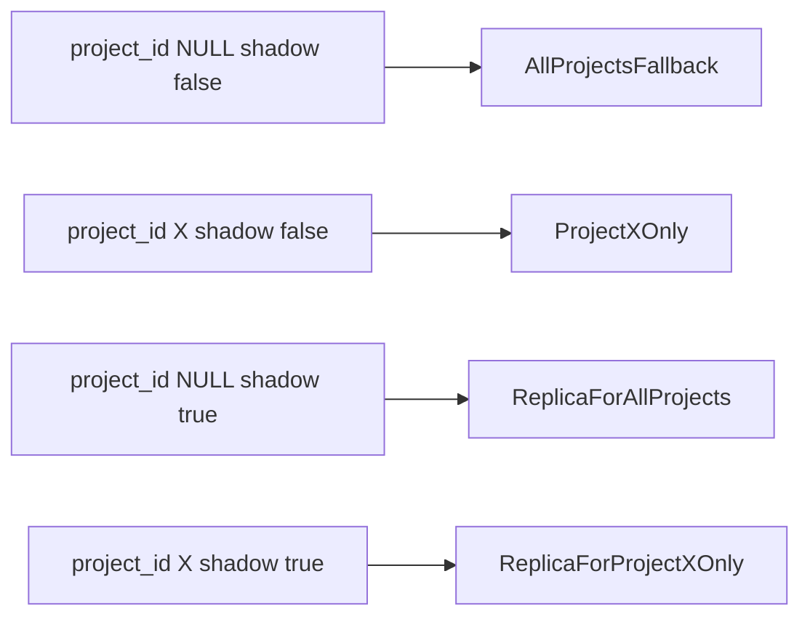

---

## 10) Operational Checks (Runbook SQL)

```sql
-- Sessions split across endpoint IDs
SELECT ra.session_id, COUNT(DISTINCT COALESCE(ra.endpoint_id, 'global-default')) AS endpoint_count
FROM recording_artifacts ra
WHERE ra.status = 'ready'
GROUP BY ra.session_id
HAVING COUNT(DISTINCT COALESCE(ra.endpoint_id, 'global-default')) > 1
ORDER BY endpoint_count DESC, ra.session_id
LIMIT 200;
```

```sql
-- Ready artifacts with invalid endpoint references
SELECT ra.id, ra.session_id, ra.kind, ra.endpoint_id, ra.s3_object_key
FROM recording_artifacts ra
LEFT JOIN storage_endpoints se ON se.id = ra.endpoint_id
WHERE ra.status = 'ready'
  AND ra.endpoint_id IS NOT NULL
  AND se.id IS NULL
ORDER BY ra.session_id, ra.kind
LIMIT 500;
```

```sql
-- Backup coverage by project
SELECT
  s.project_id,
  COUNT(*) FILTER (WHERE bl.session_id IS NOT NULL) AS backed_up_sessions,
  COUNT(*) AS eligible_sessions,
  ROUND((COUNT(*) FILTER (WHERE bl.session_id IS NOT NULL)::numeric / NULLIF(COUNT(*), 0)) * 100, 2) AS backup_coverage_percent
FROM sessions s
LEFT JOIN session_backup_log bl ON bl.session_id = s.id
WHERE s.status IN ('ready', 'completed')
GROUP BY s.project_id
ORDER BY backup_coverage_percent ASC, eligible_sessions DESC;
```

---

## 11) Source Files

- `backend/src/db/s3.ts`
- `backend/src/routes/ingestUploadRelay.ts`
- `backend/src/services/ingestArtifactLifecycle.ts`
- `backend/src/services/sessionBackupGate.ts`
- `backend/src/services/sessionArtifactPurge.ts`
- `backend/src/worker/retentionWorker.ts`
- `scripts/k8s/session-backup.mjs`
- `k8s/archive.yaml`
- `docs/selfhosted/backup-recovery.md`
# Storage Endpoints & Shadow System

> Multi-endpoint S3 architecture with redundancy, encryption, and runtime management. The database is the source of truth for storage configuration in production deployments.

---

## Overview

Rejourney supports **multiple S3 endpoints** per project with **weighted load balancing** and **automatic shadow copies** for redundancy. This is managed entirely through the `storage_endpoints` table in PostgreSQL.

**Key concept:** In Production (Distributed Cloud), S3 credentials are **never** in environment variables. They're encrypted and stored in the database, managed via the [manage-s3-endpoints.mjs](/scripts/k8s/manage-s3-endpoints.mjs) script. In Self-Hosted mode, the system gracefully falls back to `.env` variables if the table is empty.

**Deployment modes:**
- **Self-hosted Docker / dev Docker:** Typically a single S3 endpoint (MinIO or external). No load balancing.
- **K3s (production):** May use multiple storage endpoints with weighted load balancing. Each artifact stores `endpoint_id` at upload so the ingest worker downloads from the same endpoint.

---

## Architecture Overview

```
Flow Index:
┌──────────────────────────────────────────────────────────────────────────────┐
│ [S1] SDK Uploads → [S2] Presign API → [S3] Endpoint Resolution → [S4] S3   │
│                                             ↓ (parallel)                     │
│ [S5] Shadow Uploads (fire-and-forget, async)                                │
│                                                                              │
│ [S6] Config & Credentials → [S7] Encryption/Decryption                      │
│ [S8] K3s Management via manage-s3-endpoints.mjs                             │
└──────────────────────────────────────────────────────────────────────────────┘
```

---

## [S1] SDK Upload Flow

Mobile SDKs request presigned URLs from the API:

```
SDK (React Native / Mobile)
    ↓
    POST /api/ingest/presign (with projectId, contentType, sizeBytes)
    ↓
    API validates billing + quotas
    ↓
    Returns presigned S3 upload URL
    ↓
    SDK uploads directly to S3
    ↓
    SDK calls POST /api/ingest/batch/complete (idempotent)
    ↓
    API records artifact metadata + shadow copies queued
```

Key endpoint: [POST /api/ingest/presign](backend/src/routes/ingest.ts#L72)

---

## [S2] Presign API

The `/api/ingest/presign` endpoint generates a signed URL using the project's designated endpoint.

```typescript
// Simplified flow
const endpoint = await getEndpointForProject(projectId);
const signedUrl = await getSignedUploadUrl(
    projectId,
    key,
    contentType,
    3600 // 1 hour expiry
);
return { url: signedUrl, endpointId: endpoint.id };
```

**Important:** The `endpointId` is stored on the `recording_artifacts` row when the artifact is created. The ingest worker uses this to download from the **same endpoint** the SDK uploaded to. This enables weighted load balancing in k3s (multiple endpoints) without NoSuchKey errors.

---

## [S3] Endpoint Resolution Layer

### Database Schema

```sql
CREATE TABLE "storage_endpoints" (
    "id" uuid PRIMARY KEY DEFAULT gen_random_uuid(),
    "project_id" uuid,                    -- NULL = global default
    "endpoint_url" text NOT NULL,         -- S3 endpoint (AWS, MinIO, etc.)
    "bucket" varchar(255) NOT NULL,
    "region" varchar(50),
    "access_key_id" varchar(255),
    "key_ref" varchar(255),               -- ENCRYPTED secret key (AES-256-GCM)
    "role_arn" varchar(255),              -- Optional: AWS IAM role
    "kms_key_id" varchar(255),            -- Optional: KMS key for encryption at rest
    "priority" integer DEFAULT 0 NOT NULL,-- Weight for load balancing
    "active" boolean DEFAULT true NOT NULL,
    "shadow" boolean DEFAULT false NOT NULL -- Redundancy flag
);
```

### Endpoint Selection Algorithm

```typescript
async function getEndpointForProject(projectId: string): Promise<StorageEndpoint> {
    // 1) Query project-specific endpoints (non-shadow, active only)
    let endpoints = await db
        .select()
        .from(storageEndpoints)
        .where(and(
            eq(storageEndpoints.projectId, projectId),
            eq(storageEndpoints.active, true),
            eq(storageEndpoints.shadow, false)
        ))
        .orderBy(desc(storageEndpoints.priority));

    // 2) If none found, query global endpoints (projectId = NULL)
    if (endpoints.length === 0) {
        endpoints = await db
            .select()
            .from(storageEndpoints)
            .where(and(
                isNull(storageEndpoints.projectId),
                eq(storageEndpoints.active, true),
                eq(storageEndpoints.shadow, false)
            ))
            .orderBy(desc(storageEndpoints.priority));
    }

    // 3) If still none, fallback to .env variables (Self-Hosted only)
    if (endpoints.length === 0 && config.SELF_HOSTED_MODE) {
        return {
            id: 'env-fallback',
            projectId: null,
            endpointUrl: config.S3_ENDPOINT,
            bucket: config.S3_BUCKET,
            region: config.S3_REGION,
            accessKeyId: config.S3_ACCESS_KEY_ID || null,
            keyRef: config.S3_SECRET_ACCESS_KEY || null,
            priority: 100,
            active: true,
            shadow: false,
        };
    }

    // 4) If multiple endpoints, use weighted random selection
    if (endpoints.length > 1) {
        return selectWeightedRandom(endpoints);
    }

    return endpoints[0];
}
```

### Weighted Load Balancing

When multiple endpoints exist for a project, selection is **weighted by priority**:

```typescript
function selectWeightedRandom(endpoints: StorageEndpoint[]): StorageEndpoint {
    // Weight = priority + 1
    // Priority 0 → weight 1, Priority 10 → weight 11, etc.
    const totalWeight = endpoints.reduce((sum, e) => sum + (e.priority + 1), 0);
    let random = Math.random() * totalWeight;

    for (const endpoint of endpoints) {
        random -= (endpoint.priority + 1);
        if (random <= 0) return endpoint;
    }
    return endpoints[0]; // fallback
}
```

**Example:** Two endpoints with priority 0 and priority 9 will be selected ~1:10 ratio.

### Artifact Endpoint Pinning (K3s Load Balancing)

When multiple endpoints exist, the API selects one at random for each presign. The chosen `endpointId` is stored on `recording_artifacts.endpoint_id`. The ingest worker reads this and downloads from that specific endpoint via `downloadFromS3ForArtifact()`. Legacy artifacts (created before this column existed) have `endpoint_id = null`; the worker falls back to `getEndpointForProject()` for those.

```sql
-- recording_artifacts.endpoint_id (nullable)
-- Pins artifact to upload endpoint. Worker uses for download.
ALTER TABLE recording_artifacts ADD COLUMN endpoint_id varchar(255);
```

### Caching

Endpoints are cached per projectId with a TTL to avoid repeated database queries:

```typescript
const endpointCache = new Map<string | null, CachedEndpoint>();

interface CachedEndpoint {
    endpoint: StorageEndpoint;
    expiresAt: number;  // Timestamp
}
```

---

## [S4] S3 Client Pool

Each endpoint has its own **S3Client instance** cached in memory:

```typescript
const s3ClientPool = new Map<string, S3ClientEntry>();

interface S3ClientEntry {
    client: S3Client;              // For server-side operations
    publicClient: S3Client;        // For presigned URLs (public endpoint)
    bucket: string;
}
```

### Credential Resolution

For each endpoint:

```typescript
const accessKeyId = config.SELF_HOSTED_MODE
    ? (endpoint.accessKeyId || config.S3_ACCESS_KEY_ID)
    : endpoint.accessKeyId;

const secretAccessKey = config.SELF_HOSTED_MODE
    ? (safeDecrypt(endpoint.keyRef) || config.S3_SECRET_ACCESS_KEY)
    : safeDecrypt(endpoint.keyRef);
```

**In Production:** Always reads from database (encrypted).  
**In Self-Hosted:** Falls back to .env if database is empty.

### Client Configuration

```typescript
const clientConfig = {
    endpoint: endpoint.endpointUrl,
    region: endpoint.region || undefined,
    credentials: {
        accessKeyId,
        secretAccessKey,
    },
    forcePathStyle: true,  // Required for MinIO and S3-compatible services
};
```

---

## [S5] Upload Operations

### Primary Upload

```typescript
export async function uploadToS3(
    projectId: string,
    key: string,
    body: Buffer | string,
    contentType: string = 'application/octet-stream',
    metadata?: Record<string, string>
): Promise<{ success: boolean; endpointId: string; error?: string }> {
    const endpoint = await getEndpointForProject(projectId);
    const { client, bucket } = getS3ClientForEndpoint(endpoint);

    try {
        await client.send(
            new PutObjectCommand({
                Bucket: bucket,
                Key: key,
                Body: body,
                ContentType: contentType,
                Metadata: metadata,
            })
        );

        logger.debug({ key, endpointId: endpoint.id }, 'Uploaded to S3');

        // Queue shadow uploads (fire-and-forget)
        uploadToShadows(projectId, key, body, contentType, metadata).catch(err => {
            logger.warn({ err, key }, 'Shadow upload failed');
        });

        return { success: true, endpointId: endpoint.id };
    } catch (err) {
        logger.error({ err, key, endpointId: endpoint.id }, 'Failed to upload to S3');
        return { success: false, endpointId: endpoint.id, error: String(err) };
    }
}
```

**Key behavior:**
1. Uploads to the selected primary endpoint (weighted by priority)
2. Returns `endpointId` so clients know where the file went
3. Queues shadow uploads **async** (doesn't block the response)
4. Shadow failures are logged but **don't fail the upload**

### Shadow Uploads (Redundancy)

```typescript
async function uploadToShadows(
    projectId: string,
    key: string,
    body: Buffer | string,
    contentType: string,
    metadata?: Record<string, string>
): Promise<void> {
    const shadows = await getShadowEndpoints(projectId);

    const uploads = shadows.map(async (endpoint) => {
        const { client, bucket } = getS3ClientForEndpoint(endpoint);
        try {
            await client.send(
                new PutObjectCommand({
                    Bucket: bucket,
                    Key: key,
                    Body: body,
                    ContentType: contentType,
                    Metadata: metadata,
                })
            );
            logger.debug({ key, endpointId: endpoint.id }, 'Shadow upload complete');
        } catch (err) {
            logger.warn({ err, key, endpointId: endpoint.id }, 'Shadow upload failed');
        }
    });

    await Promise.allSettled(uploads);
}
```

### Shadow Endpoint Query

```typescript
export async function getShadowEndpoints(projectId: string): Promise<StorageEndpoint[]> {
    const endpoints = await db
        .select()
        .from(storageEndpoints)
        .where(and(
            eq(storageEndpoints.active, true),
            eq(storageEndpoints.shadow, true)
        ))
        .orderBy(desc(storageEndpoints.priority));

    // Project-specific shadows first, then global shadows
    const projectShadows = endpoints.filter(e => e.projectId === projectId);
    const globalShadows = endpoints.filter(e => e.projectId === null);

    return [...projectShadows, ...globalShadows];
}
```

**Use case:** Replicate recording data to Hetzner S3 + MinIO simultaneously for redundancy.

---

## [S6] Configuration & Environment

### K3s Deployment

In [k8s/api.yaml](k8s/api.yaml), the API pod injects S3 config from Kubernetes secrets:

```yaml
env:
  - name: S3_ENDPOINT
    valueFrom:
      secretKeyRef:
        name: s3-secret
        key: S3_ENDPOINT
  - name: S3_PUBLIC_ENDPOINT
    valueFrom:
      secretKeyRef:
        name: s3-secret
        key: S3_PUBLIC_ENDPOINT
  - name: S3_BUCKET
    valueFrom:
      secretKeyRef:
        name: s3-secret
        key: S3_BUCKET
  - name: S3_REGION
    valueFrom:
      secretKeyRef:
        name: s3-secret
        key: S3_REGION
  - name: S3_ACCESS_KEY_ID
    valueFrom:
      secretKeyRef:
        name: s3-secret
        key: S3_ACCESS_KEY_ID
  - name: S3_SECRET_ACCESS_KEY
    valueFrom:
      secretKeyRef:
        name: s3-secret
        key: S3_SECRET_ACCESS_KEY
```

These are **fallback only**. The real endpoints come from the database.

### Self-Hosted Deployment

In `docker-compose.selfhosted.yml`, variables are passed directly:

```env
S3_ENDPOINT=http://minio:9000
S3_BUCKET=rejourney
S3_REGION=us-east-1
S3_ACCESS_KEY_ID=minioadmin
S3_SECRET_ACCESS_KEY=minioadmin
```

If the `storage_endpoints` table is empty, the app creates a "virtual endpoint" at runtime using these variables.

---

## [S7] Encryption & Decryption

### Secret Key Encryption

When adding a storage endpoint, the S3 secret access key is **encrypted before storage**:

```typescript
function encrypt(plaintext: string, keyHex: string): string {
    const key = Buffer.from(keyHex, 'hex');
    const iv = crypto.randomBytes(12);  // 96-bit IV for AES-GCM

    const cipher = crypto.createCipheriv('aes-256-gcm', key, iv);
    const encrypted = Buffer.concat([
        cipher.update(plaintext, 'utf8'),
        cipher.final()
    ]);
    const authTag = cipher.getAuthTag();

    // Format: base64(iv):base64(authTag):base64(ciphertext)
    return `${iv.toString('base64')}:${authTag.toString('base64')}:${encrypted.toString('base64')}`;
}
```

### Secret Key Decryption

At runtime, the encrypted `key_ref` is decrypted:

```typescript
export function safeDecrypt(encryptedHex: string): string | null {
    if (!encryptedHex || !config.STORAGE_ENCRYPTION_KEY) {
        return null;
    }

    try {
        const [ivB64, authTagB64, ciphertextB64] = encryptedHex.split(':');
        const key = Buffer.from(config.STORAGE_ENCRYPTION_KEY, 'hex');
        const iv = Buffer.from(ivB64, 'base64');
        const authTag = Buffer.from(authTagB64, 'base64');
        const ciphertext = Buffer.from(ciphertextB64, 'base64');

        const decipher = crypto.createDecipheriv('aes-256-gcm', key, iv);
        decipher.setAuthTag(authTag);

        const plaintext = Buffer.concat([
            decipher.update(ciphertext),
            decipher.final()
        ]).toString('utf8');

        return plaintext;
    } catch (err) {
        logger.warn({ err }, 'Decryption failed');
        return null;
    }
}
```

### Key Management

The `STORAGE_ENCRYPTION_KEY` is:
- **64 hex characters** (32 bytes for AES-256)
- Stored in `.env` (K3s) or Docker secrets
- **Never** sent to the database
- Rotated by ops (requires re-encryption of stored keys)

---

## [S8] K3s Management Script

### add-s3-endpoints.mjs

Interactive script to add or update storage endpoints in a live K3s cluster **without downtime**:

```bash
./scripts/k8s/manage-s3-endpoints.mjs
```

#### Flow:

```
1) Prompts for STORAGE_ENCRYPTION_KEY (reads from .env or user input)
2) Prompts for S3 endpoint details:
   - Endpoint URL
   - Bucket name
   - Region
   - Access Key ID
   - Secret Access Key
3) Prompts for configuration:
   - Project UUID (blank = global)
   - Priority (integer)
   - Shadow Endpoint? (y/n)
4) Encrypts the secret key using STORAGE_ENCRYPTION_KEY
5) Generates SQL INSERT statement
6) Executes via kubectl:
   echo "INSERT INTO storage_endpoints..." | \
   kubectl exec -i postgres-0 -n rejourney -- psql -U rejourney -d rejourney
```

#### Example SQL Generated:

```sql
INSERT INTO storage_endpoints (
    project_id, 
    endpoint_url, 
    bucket, 
    region, 
    access_key_id, 
    key_ref, 
    priority, 
    active, 
    shadow
) VALUES (
    NULL,
    'https://s3.amazonaws.com',
    'my-bucket',
    'us-east-1',
    'AKIA...',
    'HnL3+Vq....:base64_authTag:base64_ciphertext',  -- encrypted
    50,
    true,
    false
);
```

### Adding a Shadow Endpoint

```bash
./scripts/k8s/manage-s3-endpoints.mjs

? Enter STORAGE_ENCRYPTION_KEY: 0123456789abcdef0123456789abcdef0123456789abcdef0123456789abcdef
? S3 Endpoint URL: https://minio.internal.example.com
? S3 Bucket Name: backups
? S3 Region: us-east-1
? S3 Access Key ID: minioadmin
? S3 Secret Access Key: minioadmin123
? Project UUID (leave blank for global): 
? Priority (integer, default 0): 10
? Shadow Endpoint? (y/n, default n): y
```

Result: A global shadow endpoint with priority 10 will receive copies of all recordings.

---

## Integration Points

### Ingest Flow ([POST /api/ingest/batch/complete](backend/src/routes/ingest.ts))

```typescript
1. Validate idempotency (Redis)
2. Create/fetch session record
3. Call uploadToS3(projectId, key, body, ...)
   └─ Returns { success, endpointId, error? }
4. Store endpointId in recording_artifacts table
5. Update session_metrics
6. Fire-and-forget shadow uploads
7. Return 200 OK
```

### Download Flow ([GET /api/sessions/{id}/artifacts](backend/src/routes/sessions.ts))

```typescript
1. Fetch artifact record (includes stored endpointId)
2. Call getSignedDownloadUrl(endpointId, key)
3. Return presigned URL to SDK
4. SDK downloads directly from that endpoint
```

### Endpoint Enumeration (Admin API)

```typescript
GET /api/admin/storage-endpoints
├─ List all endpoints
├─ Show active/inactive status
├─ Show shadow flag
└─ Show priority weight
```

---

## Operational Patterns

### Multi-Bucket Strategy

```
Global Default: AWS S3 (priority 0)
    └─ All projects use this if no override

Project Override: MinIO (priority 50, shadow = false)
    └─ Project "acme-corp" uses MinIO instead

Shadow Backup: Backblaze B2 (priority 0, shadow = true)
    └─ All uploads go to both AWS and B2
```

### Region Failover

```
Primary: us-east-1 bucket (priority 100)
Fallback: us-west-2 bucket (priority 0)

When us-east-1 is unavailable:
→ Presign requests still try us-east-1 first (may fail)
→ Next ingest request falls through to us-west-2
→ Shadow uploads try both
```

### Gradual Migration

```
Old S3 Provider (priority 10)
    ↓ (existing uploads go here)

New S3 Provider (priority 50)
    ↓ (new uploads prefer here)

After monitoring, set old to shadow = true
    → New uploads still go to new provider
    → Old provider gets shadow copies for redundancy
```

---

## Monitoring

### Key Metrics to Track

- **Shadow upload failures**: `logger.warn({ err, key, endpointId }, 'Shadow upload failed')`
- **Endpoint resolution latency**: Cache hit rate for `endpointCache`
- **Credential decryption failures**: Count of `safeDecrypt()` errors
- **S3 client pool size**: `s3ClientPool.size` (should be < number of endpoints)

### Debug Logging

```typescript
logger.debug({ key, endpointId: endpoint.id }, 'Uploaded to S3');
logger.debug({ key, endpointId: endpoint.id }, 'Shadow upload complete');
logger.error({ err, key, endpointId: endpoint.id }, 'Failed to upload to S3');
```

### Endpoint Health Check

```bash
# In K3s:
kubectl exec -it api-0 -n rejourney -- \
  node -e "
    const { getEndpointForProject } = await import('./src/db/s3.js');
    const ep = await getEndpointForProject('project-uuid');
    console.log(JSON.stringify(ep, null, 2));
  "
```

---

## Troubleshooting

### No Endpoints Found

**Symptom:** `Error: No storage endpoint configured. Populate storage_endpoints table or run db:seed.`

**Solution:**
1. Check if running in Self-Hosted mode:
   ```bash
   echo $SELF_HOSTED_MODE  # should be 'true'
   ```
2. Verify .env variables:
   ```bash
   grep S3 .env
   ```
3. Add endpoints via manage-s3-endpoints.mjs:
   ```bash
   ./scripts/k8s/manage-s3-endpoints.mjs
   ```

### Decryption Failures

**Symptom:** `logger.warn(...) 'Decryption failed'`

**Causes:**
- `STORAGE_ENCRYPTION_KEY` changed (key rotation issue)
- `key_ref` column corrupted in database

**Solution:**
```sql
-- Verify encryption key
SELECT COUNT(*) FROM storage_endpoints WHERE key_ref IS NOT NULL;

-- Re-encrypt with new key (ops procedure)
-- 1. Export plaintext secrets from old key
-- 2. Update STORAGE_ENCRYPTION_KEY
-- 3. Re-encrypt and update key_ref column
-- 4. Restart API pods
```

### Shadow Uploads Slow or Failing

**Symptom:** Primary uploads succeed, but shadow endpoints aren't getting copies.

**Check:**
```sql
SELECT * FROM storage_endpoints WHERE shadow = true;
```

**Debug:**
```typescript
// Add temporary log in uploadToShadows()
const shadows = await getShadowEndpoints(projectId);
logger.info({ shadowCount: shadows.length, projectId }, 'Shadow endpoints');
```

### Presigned URLs Returning Wrong Endpoint

**Symptom:** `GET /api/download/{id}` presigned URL fails to validate.

**Causes:**
- `endpointId` mismatch (artifact stored with old endpointId)
- Endpoint marked `active = false` after upload

**Solution:**
```sql
-- List all endpoints with their artifacts
SELECT 
    ep.id, ep.endpoint_url, ep.active, ep.shadow,
    COUNT(ra.id) as artifact_count
FROM storage_endpoints ep
LEFT JOIN recording_artifacts ra ON ra.endpoint_id = ep.id
GROUP BY ep.id;
```

---

## References

- [Database Schema](backend/drizzle/20260207004512_marvelous_skrulls/migration.sql#L485-L500)
- [S3 Client Implementation](backend/src/db/s3.ts)
- [Ingest Routes](backend/src/routes/ingest.ts)
- [Management Script](scripts/k8s/manage-s3-endpoints.mjs)
- [K3s API Manifest](k8s/api.yaml)
- [K3s Postgres Manifest](k8s/postgres.yaml)
